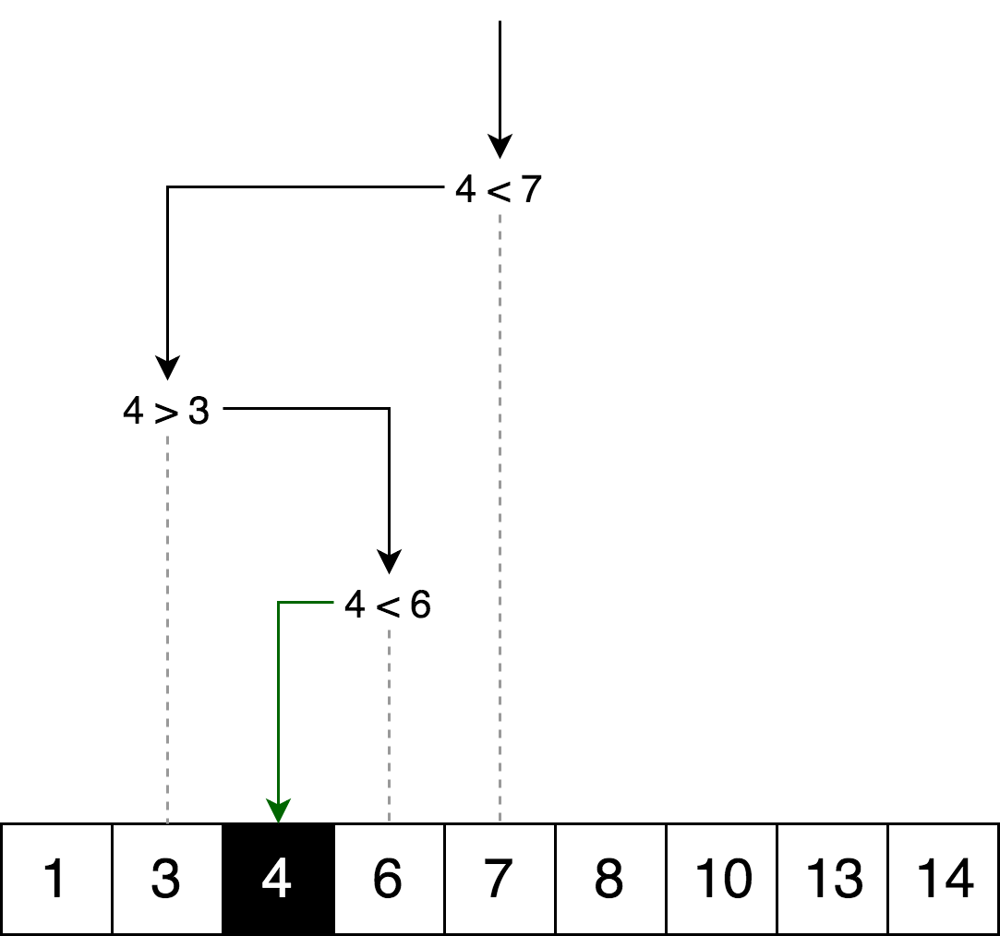
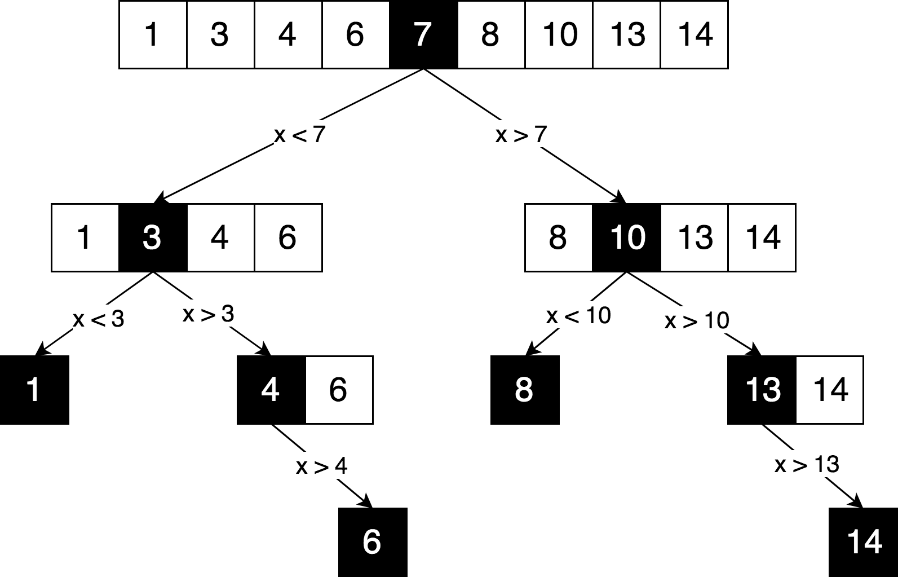
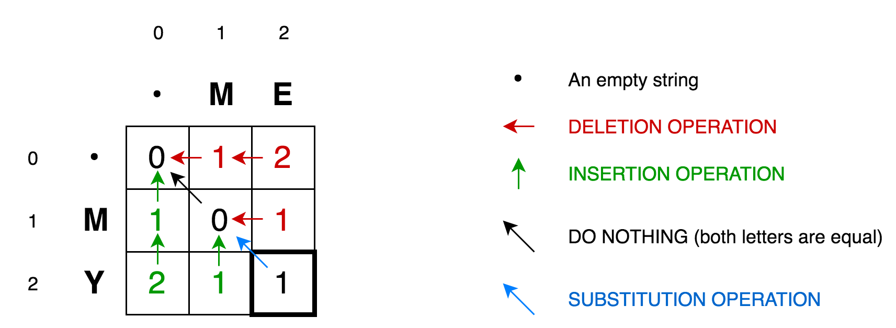

## TL;DR

In this article I’m trying to explain the difference/similarities between dynamic programing and divide and conquer approaches based on two examples: [binary search](https://github.com/trekhleb/javascript-algorithms/tree/master/src/algorithms/search/binary-search) and [minimum edit distance](https://github.com/trekhleb/javascript-algorithms/tree/master/src/algorithms/string/levenshtein-distance) (Levenshtein distance).

## The Problem

When I [started to learn algorithms](https://github.com/trekhleb/javascript-algorithms) it was hard for me to understand the main idea of dynamic programming (**DP**) and how it is different from divide-and-conquer (**DC**) approach. When it gets to comparing those two paradigms usually Fibonacci function comes to the rescue as great [example](https://stackoverflow.com/questions/13538459/difference-between-divide-and-conquer-algo-and-dynamic-programming). But when we’re trying to solve the **same** problem using both DP and DC approaches to explain each of them, it feels for me like we may **lose valuable detail** that might help to catch the difference faster. These detail tells us that each technique serves best for **different** types of problems.

I’m still in the process of understanding DP and DC difference, and I can’t say that I’ve fully grasped the concepts so far. But I hope this article will shed some extra light and help you to do another step of learning such valuable algorithm paradigms as dynamic programming and divide-and-conquer.

## Dynamic Programming and Divide-and-Conquer Similarities

As I see it for now I can say that **dynamic programming is an extension of the divide and conquer paradigm**.

I would **not** treat them as something completely different. Because **they both work by recursively breaking down a problem into two or more sub-problems** of the same or related type, until these become simple enough to be solved directly. The solutions to the sub-problems are then combined to give a solution to the original problem.

So why do we still have different paradigm names then and why I called dynamic programming an extension. It is because dynamic programming approach may be applied to the problem **only if the problem has certain restrictions or prerequisites**. After that dynamic programming extends divide and conquer approach with **memoization** or **tabulation** technique.

Let’s go step by step...

## Dynamic Programming Prerequisites/Restrictions

As we’ve just discovered there are two key attributes that divide and conquer problem must have in order for dynamic programming to be applicable:

- [Optimal substructure](https://en.wikipedia.org/wiki/Optimal_substructure) - optimal solution can be constructed from optimal solutions of its sub-problems
- [Overlapping sub-problems](https://en.wikipedia.org/wiki/Overlapping_subproblems) - problem can be broken down into sub-problems which are reused several times, or a recursive algorithm for the problem solves the same sub-problem over and over rather than always generating new sub-problems

Once these two conditions are met we can say that this divide and conquer problem may be solved using dynamic programming approach.

## Dynamic Programming Extension for Divide and Conquer

Dynamic programming approach extends divide and conquer approach with two techniques (**memoization** and **tabulation**) that both have a purpose of storing and re-using sub-problems solutions that may drastically improve performance. For example naive recursive implementation of Fibonacci function has time complexity of `O(2^n)` where DP solution doing the same with only `O(n)` time.

**Memoization (top-down cache filling)** refers to the technique of caching and reusing previously computed results. The memoized `fib` function would thus look like this:

```text
memFib(n) {
    if (mem[n] is undefined)
        if (n < 2) result = n
        else result = memFib(n-2) + memFib(n-1)
        mem[n] = result
    return mem[n]
}
```

**Tabulation (bottom-up cache filling)** is similar but focuses on filling the entries of the cache. Computing the values in the cache is easiest done iteratively. The tabulation version of `fib` would look like this:

```text
tabFib(n) {
    mem[0] = 0
    mem[1] = 1
    for i = 2...n
        mem[i] = mem[i-2] + mem[i-1]
    return mem[n]
}
```

You may read more about memoization and tabulation comparison [here](https://programming.guide/dynamic-programming-vs-memoization-vs-tabulation.html).

The main idea you should grasp here is that because our divide and conquer problem has overlapping sub-problems the caching of sub-problem solutions becomes possible and thus memoization/tabulation step up onto the scene.

## So What the Difference Between DP and DC After All

Since we’re now familiar with DP prerequisites and its methodologies we’re ready to put all that was mentioned above into one picture.


<center><i>
Dynamic programming and divide and conquer paradigms dependency
</i></center>

Let’s go and try to solve some problems using DP and DC approaches to make this illustration more clear.

## Divide and Conquer Example: Binary Search

[Binary search](https://en.wikipedia.org/wiki/Binary_search_algorithm) algorithm, also known as half-interval search, is a search algorithm that finds the position of a target value within a sorted array. Binary search compares the target value to the middle element of the array; if they are unequal, the half in which the target cannot lie is eliminated and the search continues on the remaining half until the target value is found. If the search ends with the remaining half being empty, the target is not in the array.

### Example

Here is a visualization of the binary search algorithm where 4 is the target value.



<center><i>
Binary search algorithm logic
</i></center>

Let’s draw the same logic but in form of decision tree.



<center><i>
Binary search algorithm decision tree
</i></center>

You may clearly see here a divide and conquer principle of solving the problem. We’re iteratively breaking the original array into sub-arrays and trying to find required element in there.

Can we apply dynamic programming to it? **No**. It is because **there are no overlapping sub-problems**. Every time we split the array into completely independent parts. And according to divide and conquer prerequisites/restrictions the sub-problems **must be** overlapped somehow.

Normally every time you draw a decision tree and it is actually a **tree** (and **not** a decision **graph**) it would mean that you don’t have overlapping sub-problems and this is not dynamic programming problem.

### The Code

[Here](https://github.com/trekhleb/javascript-algorithms/tree/master/src/algorithms/search/binary-search) you may find complete source code of binary search function with test cases and explanations.

```javascript
function binarySearch(sortedArray, seekElement) {
  let startIndex = 0;
  let endIndex = sortedArray.length - 1;
  while (startIndex <= endIndex) {
    const middleIndex = startIndex + Math.floor((endIndex - startIndex) / 2);
    // If we've found the element just return its position.
    if (sortedArray[middleIndex] === seekElement) {
      return middleIndex;
    }
    // Decide which half to choose: left or right one.
    if (sortedArray[middleIndex] < seekElement) {
      // Go to the right half of the array.
      startIndex = middleIndex + 1;
    } else {
      // Go to the left half of the array.
      endIndex = middleIndex - 1;
    }
  }
  return -1;
}
```

## Dynamic Programming Example: Minimum Edit Distance

Normally when it comes to dynamic programming examples the [Fibonacci](https://github.com/trekhleb/javascript-algorithms/tree/master/src/algorithms/math/fibonacci) number algorithm is being taken by default. But let’s take a little bit more complex algorithm to have some kind of variety that should help us to grasp the concept.

[Minimum Edit Distance](https://en.wikipedia.org/wiki/Levenshtein_distance) (or Levenshtein Distance) is a string metric for measuring the difference between two sequences. Informally, the Levenshtein distance between two words is the minimum number of single-character edits (*insertions, deletions or substitutions*) required to change one word into the other.

### Example

For example, the Levenshtein distance between “kitten” and “sitting” is 3, since the following three edits change one into the other, and there is no way to do it with fewer than three edits:

- **k**itten → **s**itten (substitution of “s” for “k”)
- sitt**e**n → sitt**i**n (substitution of “i” for “e”)
- sittin → sittin**g** (insertion of “g” at the end).

### Applications

This has a wide range of applications, for instance, spell checkers, correction systems for optical character recognition, fuzzy string searching, and software to assist natural language translation based on translation memory.

### Mathematical Definition

Mathematically, the Levenshtein distance between two strings `a`, `b` (of length `|a|` and `|b|` respectively) is given by function `lev(|a|, |b|)` where:


Note that the first element in the minimum corresponds to **deletion** (from `a` to `b`), the second to **insertion** and the third to **match or mismatch**, depending on whether the respective symbols are the same.

### Explanation

Ok, let’s try to figure out what that formula is talking about. Let’s take a simple example of finding minimum edit distance between strings **ME** and **MY**. Intuitively you already know that minimum edit distance here is **1** operation and this operation is *“replace **E** with **Y**”*. But let’s try to formalize it in a form of the algorithm in order to be able to do more complex examples like transforming **Saturday** into **Sunday**.

To apply the formula to M**E**→M**Y** transformation we need to know minimum edit distances of ME→M, M→MY and M→M transformations in prior. Then we will need to pick the minimum one and add +1 operation to transform last letters E→Y.

So we can already see here a recursive nature of the solution: minimum edit distance of ME→MY transformation is being calculated based on three previously possible transformations. Thus we may say that this is **divide and conquer algorithm**.

To explain this further let’s draw the following matrix.



<center><i>
Simple example of finding minimum edit distance between ME and MY strings
</i></center>

- **Cell (0,1)** contains red number 1. It means that we need 1 operation to transform **M** to **empty string**: delete **M**. This is why this number is red.
- **Cell (0,2)** contains red number 2. It means that we need 2 operations to transform **ME** to **empty string**: delete **E**, delete **M**.
- **Cell (1,0)** contains green number 1. It means that we need 1 operation to transform empty string to **M**: insert **M**. This is why this number is green.
- **Cell (2,0)** contains green number 2. It means that we need 2 operations to transform empty string to **MY**: insert **Y**, insert **M**.
- **Cell (1,1)** contains number 0. It means that it costs nothing to transform **M** to **M**.
- **Cell (1,2)** contains red number 1. It means that we need 1 operation to transform **ME** to **M**: delete **E**.
- And so on...

This looks easy for such small matrix as ours (it is only 3x3). But how we could calculate all those numbers for bigger matrices (let’s say 9x7 one, for Saturday→Sunday transformation)?

The good news is that according to the formula you only need three adjacent cells `(i-1, j)`, `(i-1, j-1)`, and `(i, j-1)` to calculate the number for current cell `(i, j)` . All we need to do is to find the minimum of those three cells and then add +1 in case if we have different letters in `i`-s row and `j`-s column

So, once again you may clearly see the recursive nature of the problem.


<center><i>
Recursive nature of minimum edit distance problem
</i></center>

Ok we’ve just found out that we’re dealing with divide and conquer problem here. But can we apply dynamic programming approach to it? Does this problem satisfies our **overlapping sub-problems** and **optimal substructure** restrictions? **Yes**. Let’s see it from decision graph.


<center><i>
Decision graph for minimum edit distance with overlapping sub-problems
</i></center>

First, this is **not** a decision **tree**. It is a decision **graph**. You may see a number of **overlapping sub-problems** on the picture that are marked with red. Also, there is no way to reduce the number of operations and make it less than a minimum of those three adjacent cells from the formula.

Also, you may notice that each cell number in the matrix is being calculated based on previous ones. Thus, the **tabulation** technique (filling the cache in bottom-up direction) is being applied here. You’ll see it in code example below.

Applying these principles further we may solve more complicated cases like with Saturday→Sunday transformation.


<center><i>
Minimum edit distance to convert Saturday to Sunday
</i></center>

### The Code

[Here](https://github.com/trekhleb/javascript-algorithms/tree/master/src/algorithms/string/levenshtein-distance) you may find complete source code of minimum edit distance function with test cases and explanations.

```javascript
function levenshteinDistance(a, b) {
  const distanceMatrix = Array(b.length + 1)
    .fill(null)
    .map(
      () => Array(a.length + 1).fill(null)
    );
  for (let i = 0; i <= a.length; i += 1) {
    distanceMatrix[0][i] = i;
  }
  for (let j = 0; j <= b.length; j += 1) {
    distanceMatrix[j][0] = j;
  }
  for (let j = 1; j <= b.length; j += 1) {
    for (let i = 1; i <= a.length; i += 1) {
      const indicator = a[i - 1] === b[j - 1] ? 0 : 1;

      distanceMatrix[j][i] = Math.min(
        distanceMatrix[j][i - 1] + 1, // deletion
        distanceMatrix[j - 1][i] + 1, // insertion
        distanceMatrix[j - 1][i - 1] + indicator, // substitution
      );
    }
  }
  return distanceMatrix[b.length][a.length];
}
```

## Conclusion

In this article we have compared two algorithmic approaches such as dynamic programming and divide-and-conquer. We’ve found out that dynamic programing is based on divide and conquer principle and may be applied only if the problem has overlapping sub-problems and optimal substructure (like in Levenshtein distance case). Dynamic programming then is using memoization or tabulation technique to store solutions of overlapping sub-problems for later usage.

I hope this article has not brought you more confusion but rather shed some light on these two important algorithmic concepts! :)

You may find more examples of divide and conquer and dynamic programming problems with explanations, comments and test cases in [JavaScript Algorithms and Data Structures](https://github.com/trekhleb/javascript-algorithms) repository.

Happy coding!
