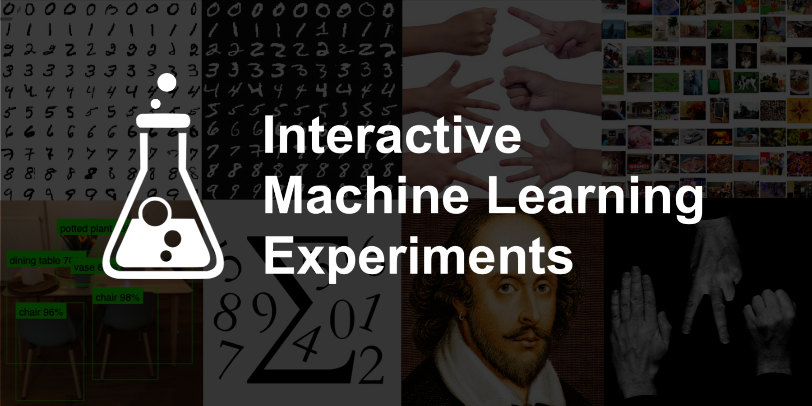
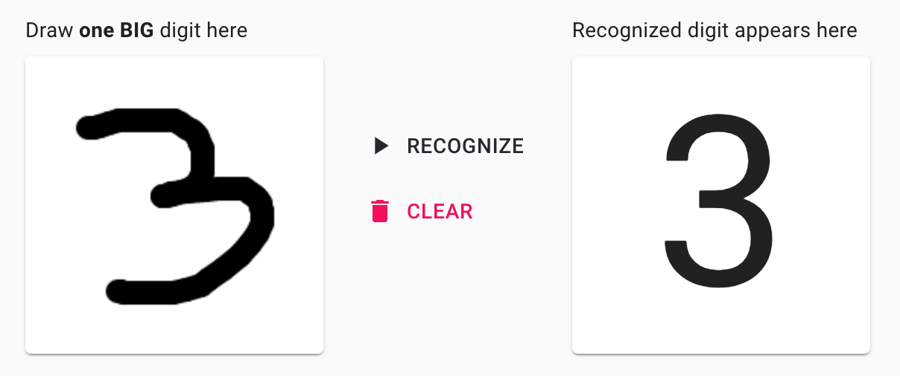
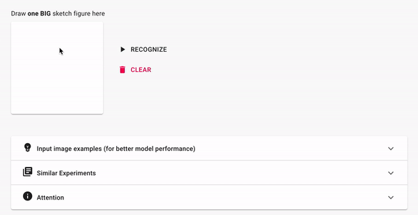
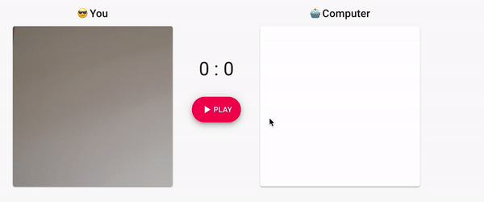
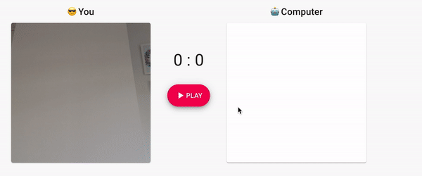
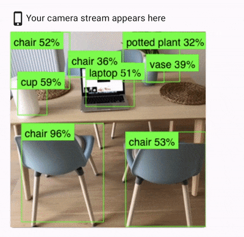
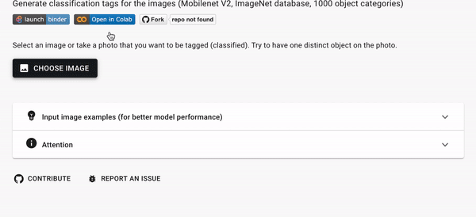
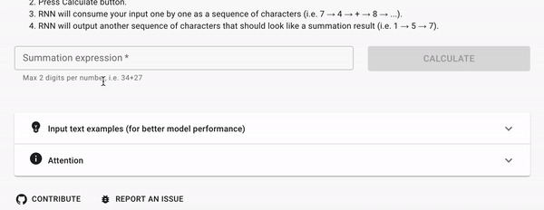
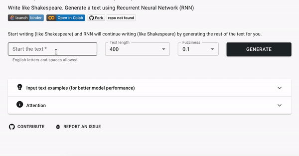
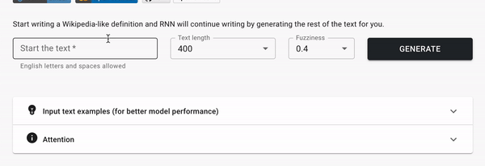

## TL;DR

Hey readers!

I've open-sourced new [🤖 Interactive Machine Learning Experiments](https://github.com/trekhleb/machine-learning-experiments) project on GitHub. Each experiment consists of 🏋️ _Jupyter/Colab notebook_ (to see how a model was trained) and 🎨 _demo page_ (to see a model in action right in your browser).

Although the models may be a little dumb (remember, these are just experiments, not a production ready code), they will try to do their best to:

- 🖌 Recognize digits or sketches you draw in your browser
- 📸 Detect and recognize the objects you'll show to your camera
- 🌅 Classify your uploaded image
- 📝 Write a Shakespeare poem with you
- ✊🖐✌️ Play with you in Rock-Paper-Scissors game
- etc.

I've trained the models on _Python_ using _TensorFlow 2_ with _Keras_ support  and then consumed them for a demo in a browser using _React_ and _JavaScript_ version of _Tensorflow_.

## Models performance

⚠️ First, let's set our expectations.️ The repository contains machine learning **experiments** and **not** a production ready, reusable, optimised and fine-tuned code and models. This is rather a sandbox or a playground for learning and trying different machine learning approaches, algorithms and data-sets. Models might not perform well and there is a place for overfitting/underfitting.

Therefore, sometimes you might see things like this:

But be patient, sometimes the model might get smarter 🤓 and give you this:

## Background

I'm a [software engineer](https://www.linkedin.com/in/trekhleb/) and for the last several years now I've been doing mostly frontend and backend programming. In my spare time, as a hobby, I decided to dig into machine learning topics to make it less _like magic_ and _more like math_ to myself.

1. 🗓 Since **Python** might be a good choice to start experimenting with Machine Learning I decided to learn its basic syntax first. As a result a [🐍 Playground and Cheatsheet for Learning Python](https://github.com/trekhleb/learn-python) project came out. This was just to practice Python and at the same time to have a cheatsheet of basic syntax once I need it (for things like `dict_via_comprehension = {x: x**2 for x in (2, 4, 6)}` etc.).

2. 🗓 After learning a bit of Python I wanted to dig into the basic **math** behind Machine Learning. So after passing an awesome [Machine Learning course by Andrew Ng](https://www.coursera.org/learn/machine-learning) on Coursera the [🤖 Homemade Machine Learning](https://github.com/trekhleb/homemade-machine-learning) project came out. This time it was about creating a cheatsheet for basic machine learning math algorithms like linear regression, logistic regression, k-means, multilayer perceptron etc.

3. 🗓 The next attempt to play around with basic Machine Learning math was [🤖 NanoNeuron](https://github.com/trekhleb/nano-neuron). It was about 7 simple JavaScript functions that supposed to give you a feeling of how machines can actually "learn".

4. 🗓 After finishing yet another awesome [Deep Learning Specialization by Andrew Ng](https://www.coursera.org/specializations/deep-learning) on Coursera I decided to practice a bit more with **multilayer perceptrons**, **convolutional** and **recurrent neural networks** (CNNs and RNNs). This time instead of implementing everything from scratch I decided to start using some machine learning framework. I ended up using [TensorFlow 2](https://www.tensorflow.org/) with [Keras](https://www.tensorflow.org/guide/keras/overview). I also didn't want to focus too much on math (letting the framework do it for me) and instead I wanted to come up with something more practical, applicable and something I could try to play with right in my browser. As a result new [🤖 Interactive Machine Learning Experiments](https://github.com/trekhleb/machine-learning-experiments) came out that I want to describe a bit more here.

## Tech-stack

### Models training

- 🏋🏻‍ I used [Keras](https://www.tensorflow.org/guide/keras/overview) inside [TensorFlow 2](https://www.tensorflow.org/) for modelling and training. Since I had zero experience with machine learning frameworks, I needed to start with something. One of the selling points in favor of TensorFlow was that it has both Python and [JavaScript flavor](https://www.tensorflow.org/js) of the library with similar API. So eventually I used Python version for training and JavaScript version for demos.

- 🏋🏻‍ I trained TensorFlow models on Python inside [Jupyter](https://jupyter.org/) notebooks locally and sometimes used [Colab](https://colab.research.google.com/) to make the training faster on GPU.

- 💻 Most of the models were trained on good old MacBook's Pro CPU (2,9 GHz Dual-Core Intel Core i5).

- 🔢 Of course there is no way you could run away from [NumPy](https://numpy.org/) for matrix/tensors operations.

### Models demo

- 🏋🏻‍ I used [TensorFlow.js](https://www.tensorflow.org/js) to do predictions with previously trained models.

- ♻️ To convert _Keras HDF5_ models to _TensorFlow.js Layers_ format I used [TensorFlow.js converter](https://github.com/tensorflow/tfjs/tree/master/tfjs-converter). This might be inefficient to transfer the whole model (megabytes of data) to the browser instead of making predictions through HTTP requests, but again, remember that these are just experiments and not production-ready code and architecture. I wanted to avoid having a dedicated back-end service to make architecture simpler.

- 👨🏻‍🎨 The [Demo application](http://trekhleb.github.io/machine-learning-experiments) was created on [React](https://reactjs.org/) using [create-react-app](https://github.com/facebook/create-react-app) starter with a default [Flow](https://flow.org/en/) flavour for type checking.

- 💅🏻 For styling, I used [Material UI](https://material-ui.com/). It was, as they say, "to kill two birds" at once and try out a new styling framework (sorry, [Bootstrap](https://getbootstrap.com/) 🤷🏻‍).

## Experiments

So, in short, you may access Demo page and Jupyter notebooks by these links:

- 🎨 [Launch ML experiments demo](http://trekhleb.github.io/machine-learning-experiments)
- 🏋️ [Check ML experiments Jupyter notebooks](https://github.com/trekhleb/machine-learning-experiments)

### Experiments with Multilayer Perceptron (MLP)

> A [multilayer perceptron (MLP)](https://en.wikipedia.org/wiki/Multilayer_perceptron) is a class of feedforward artificial neural network (ANN). Multilayer perceptrons are sometimes referred to as "vanilla" neural networks (composed of multiple layers of perceptrons), especially when they have a single hidden layer.

#### Handwritten Digits Recognition

You draw a digit, and the model tries to recognize it.

- 🎨 [Demo](https://trekhleb.dev/machine-learning-experiments/#/experiments/DigitsRecognitionMLP)
- 🏋️ [Training in Jupyter](https://nbviewer.jupyter.org/github/trekhleb/machine-learning-experiments/blob/master/experiments/digits_recognition_mlp/digits_recognition_mlp.ipynb)
- ️🏋️  [Training in Colab](https://colab.research.google.com/github/trekhleb/machine-learning-experiments/blob/master/experiments/digits_recognition_mlp/digits_recognition_mlp.ipynb)

#### Handwritten Sketch Recognition

You draw a sketch, and the model tries to recognize it.

- 🎨 [Demo](https://trekhleb.dev/machine-learning-experiments/#/experiments/SketchRecognitionMLP)
- 🏋️ [Training in Jupyter](https://nbviewer.jupyter.org/github/trekhleb/machine-learning-experiments/blob/master/experiments/sketch_recognition_mlp/sketch_recognition_mlp.ipynb)
- ️🏋️  [Training in Colab](https://colab.research.google.com/github/trekhleb/machine-learning-experiments/blob/master/experiments/sketch_recognition_mlp/sketch_recognition_mlp.ipynb)

### Experiments with Convolutional Neural Networks (CNN)

> A [convolutional neural network (CNN, or ConvNet)](https://en.wikipedia.org/wiki/Convolutional_neural_network) is a class of deep neural networks, most commonly applied to analyzing visual imagery (photos, videos). They are used for detecting and classifying objects on photos and videos, style transfer, face recognition, pose estimation etc.

#### Handwritten Digits Recognition (CNN)

You draw a digit, and the model tries to recognize it. This experiment is similar to the one from MLP section, but it uses CNN under the hood.

- 🎨 [Demo](https://trekhleb.dev/machine-learning-experiments/#/experiments/DigitsRecognitionCNN)
- 🏋️ [Training in Jupyter](https://nbviewer.jupyter.org/github/trekhleb/machine-learning-experiments/blob/master/experiments/digits_recognition_cnn/digits_recognition_cnn.ipynb)
- ️🏋️  [Training in Colab](https://colab.research.google.com/github/trekhleb/machine-learning-experiments/blob/master/experiments/digits_recognition_cnn/digits_recognition_cnn.ipynb)

#### Handwritten Sketch Recognition (CNN)

You draw a sketch, and the model tries to recognize it. This experiment is similar to the one from MLP section, but it uses CNN under the hood.

- 🎨 [Demo](https://trekhleb.dev/machine-learning-experiments/#/experiments/SketchRecognitionCNN)
- 🏋️ [Training in Jupyter](https://nbviewer.jupyter.org/github/trekhleb/machine-learning-experiments/blob/master/experiments/sketch_recognition_cnn/sketch_recognition_cnn.ipynb)
- ️🏋️  [Training in Colab](https://colab.research.google.com/github/trekhleb/machine-learning-experiments/blob/master/experiments/sketch_recognition_cnn/sketch_recognition_cnn.ipynb)

#### Rock Paper Scissors (CNN)

You play a Rock-Paper-Scissors game with the model. This experiment uses CNN that is trained from scratch.

- 🎨 [Demo](https://trekhleb.dev/machine-learning-experiments/#/experiments/RockPaperScissorsCNN)
- 🏋️ [Training in Jupyter](https://nbviewer.jupyter.org/github/trekhleb/machine-learning-experiments/blob/master/experiments/rock_paper_scissors_cnn/rock_paper_scissors_cnn.ipynb)
- ️🏋️  [Training in Colab](https://colab.research.google.com/github/trekhleb/machine-learning-experiments/blob/master/experiments/rock_paper_scissors_cnn/rock_paper_scissors_cnn.ipynb)

#### Rock Paper Scissors (MobilenetV2)

You play a Rock-Paper-Scissors game with the model. This model uses transfer learning and is based on [MobilenetV2](https://www.tensorflow.org/api_docs/python/tf/keras/applications/MobileNetV2).

- 🎨 [Demo](https://trekhleb.dev/machine-learning-experiments/#/experiments/RockPaperScissorsMobilenetV2)
- 🏋️ [Training in Jupyter](https://nbviewer.jupyter.org/github/trekhleb/machine-learning-experiments/blob/master/experiments/rock_paper_scissors_mobilenet_v2/rock_paper_scissors_mobilenet_v2.ipynb)
- ️🏋️  [Training in Colab](https://colab.research.google.com/github/trekhleb/machine-learning-experiments/blob/master/experiments/rock_paper_scissors_mobilenet_v2/rock_paper_scissors_mobilenet_v2.ipynb)

#### Objects Detection (MobileNetV2)

You show to the model your environment through your camera, and it will try to detect and recognize the objects. This model uses transfer learning and is based on [MobilenetV2](https://www.tensorflow.org/api_docs/python/tf/keras/applications/MobileNetV2).

- 🎨 [Demo](https://trekhleb.dev/machine-learning-experiments/#/experiments/ObjectsDetectionSSDLiteMobilenetV2)
- 🏋️ [Training in Jupyter](https://nbviewer.jupyter.org/github/trekhleb/machine-learning-experiments/blob/master/experiments/objects_detection_ssdlite_mobilenet_v2/objects_detection_ssdlite_mobilenet_v2.ipynb)
- ️🏋️  [Training in Colab](https://colab.research.google.com/github/trekhleb/machine-learning-experiments/blob/master/experiments/objects_detection_ssdlite_mobilenet_v2/objects_detection_ssdlite_mobilenet_v2.ipynb)

#### Image Classification (MobileNetV2)

You upload a picture, and the model tries to classify it depending on what it "sees" on the picture. This model uses transfer learning and is based on [MobilenetV2](https://www.tensorflow.org/api_docs/python/tf/keras/applications/MobileNetV2).

- 🎨 [Demo](https://trekhleb.dev/machine-learning-experiments/#/experiments/ImageClassificationMobilenetV2)
- 🏋️ [Training in Jupyter](https://nbviewer.jupyter.org/github/trekhleb/machine-learning-experiments/blob/master/experiments/image_classification_mobilenet_v2/image_classification_mobilenet_v2.ipynb)
- ️🏋️  [Training in Colab](https://colab.research.google.com/github/trekhleb/machine-learning-experiments/blob/master/experiments/image_classification_mobilenet_v2/image_classification_mobilenet_v2.ipynb)

### Experiments with Recurrent Neural Networks (RNN)

> A [recurrent neural network (RNN)](https://en.wikipedia.org/wiki/Recurrent_neural_network) is a class of deep neural networks, most commonly applied to sequence-based data like speech, voice, text or music. They are used for machine translation, speech recognition, voice synthesis etc.

#### Numbers Summation

You type a summation expression (i.e. `17+38`), and the model predicts the result (i.e. `55`). The interesting part here is that the model treats the input as a _sequence_, meaning it learned that when you type a sequence `1` → `17` → `17+` → `17+3` → `17+38` it "translates" it to another sequence `55`. You may think about it as translating a Spanish `Hola` sequence to English `Hello`.

- 🎨 [Demo](https://trekhleb.dev/machine-learning-experiments/#/experiments/NumbersSummationRNN)
- 🏋️ [Training in Jupyter](https://nbviewer.jupyter.org/github/trekhleb/machine-learning-experiments/blob/master/experiments/numbers_summation_rnn/numbers_summation_rnn.ipynb)
- ️🏋️  [Training in Colab](https://colab.research.google.com/github/trekhleb/machine-learning-experiments/blob/master/experiments/numbers_summation_rnn/numbers_summation_rnn.ipynb)

#### Shakespeare Text Generation

You start typing a poem like Shakespeare, and the model will continue it like Shakespeare. At least it will try to do so 😀.

- 🎨 [Demo](https://trekhleb.dev/machine-learning-experiments/#/experiments/TextGenerationShakespeareRNN)
- 🏋️ [Training in Jupyter](https://nbviewer.jupyter.org/github/trekhleb/machine-learning-experiments/blob/master/experiments/text_generation_shakespeare_rnn/text_generation_shakespeare_rnn.ipynb)
- ️🏋️  [Training in Colab](https://colab.research.google.com/github/trekhleb/machine-learning-experiments/blob/master/experiments/text_generation_shakespeare_rnn/text_generation_shakespeare_rnn.ipynb)

#### Wikipedia Text Generation

You start typing a Wiki article, and the model tries to continue it.

- 🎨 [Demo](https://trekhleb.dev/machine-learning-experiments/#/experiments/TextGenerationWikipediaRNN)
- 🏋️ [Training in Jupyter](https://nbviewer.jupyter.org/github/trekhleb/machine-learning-experiments/blob/master/experiments/text_generation_wikipedia_rnn/text_generation_wikipedia_rnn.ipynb)
- ️🏋️  [Training in Colab](https://colab.research.google.com/github/trekhleb/machine-learning-experiments/blob/master/experiments/text_generation_wikipedia_rnn/text_generation_wikipedia_rnn.ipynb)

## Future plans

As I've mentioned above the main purpose of [the repository](https://github.com/trekhleb/machine-learning-experiments) is to be more like a playground for learning rather than for production-ready models. Therefore, the main plan is to **continue learning and experimenting** with deep-learning challenges and approaches. The next interesting challenges to play with might be:

- Emotions detection
- Style transfer
- Language translation
- Generating images (i.e. handwritten numbers)
- etc.

Another interesting opportunity would be to **tune existing models to make them more performant**. I believe it might give a better understanding of how to overcome overfitting and underfitting and what to do with the model if it just stuck on `60%` accuracy level for both training and validation sets and doesn't want to improve anymore 🤔.

Anyways, I hope you might find some useful insights for models training from [the repository](https://github.com/trekhleb/machine-learning-experiments) or at least to have some fun playing around with the demos!

Happy learning! 🤖
