## 📃 TL;DR

_In this article we will start solving the issue of making the printed links (i.e. in a book or in a magazine) clickable via your smartphone camera._

We will use [TensorFlow 2 Object Detection API](https://github.com/tensorflow/models/tree/master/research/object_detection) to train a custom object detector model to find positions and bounding boxes of the sub-strings like `https://` in the text image (i.e. in smartphone camera stream).

The text of each link (right continuation of `https://` bounding box) will be recognized by using [Tesseract](https://tesseract.projectnaptha.com/) library. The recognition part will not be covered in this article, but you may find the complete code example of the application in [links-detector repository](https://github.com/trekhleb/links-detector).

> 🚀 [Launch Links Detector demo](https://trekhleb.dev/links-detector/) from your smartphone to see the final result.

> 📝 [Open links-detector repository](https://github.com/trekhleb/links-detector) on GitHub to see the complete source code of the application.

Here is how the final solution will look like:


> ⚠️ Currently the application is in _experimental_ _Alpha_ stage and has [many issues and limitations](https://github.com/trekhleb/links-detector/issues?q=is%3Aopen+is%3Aissue+label%3Aenhancement). So don't raise your expectations level too high until these issues are resolved 🤷🏻‍. Also, the purpose of this article is more about learning how to work with TensorFlow 2 Object Detection API rather than coming up with a production-ready model.

> In case if Python code blocks in this article will lack proper formatting on this platform feel free to [to read the article on GitHub](https://github.com/trekhleb/links-detector/blob/master/articles/printed_links_detection/printed_links_detection.md)

## 🤷🏻‍️ The Problem

I work as a software engineer and in my own time, I learn Machine Learning as a hobby. But this is not the problem yet.

I bought a printed book about Machine Learning recently and while I was reading through the first several chapters I've encountered many printed links in the text that looked like `https://tensorflow.org/` or `https://some-url.com/which/may/be/even/longer?and_with_params=true`.

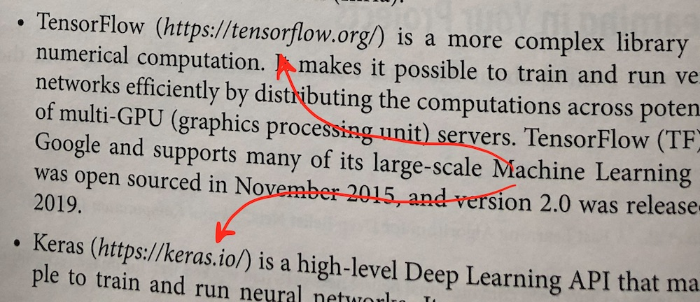

I saw all these links, but I couldn't click on them since they were printed (thanks, cap!). To visit these links I needed to start typing them character by character in the browser's address bar, which was pretty annoying and error-prone.

## 💡 Possible Solution

So, I was thinking, what if, similarly to QR-code detection, we will try to "teach" the smartphone to _(1)_ _detect_ and _(2)_ _recognize_ printed links for us and to make them _clickable_? This way you would do just one click instead of multiple keystrokes. The operational complexity of "clicking" the printed links goes from `O(N)` to `O(1)`.

This is how the final workflow will look like:


## 📝 Solution Requirements

As I've mentioned earlier I'm just studying Machine Learning as a hobby. Thus, the purpose of this article is more about _learning_ how to work with TensorFlow 2 Object Detection API rather than coming up with a production-ready application.

With that being said, I simplified the solution requirements to the following:

1. The detection and recognition processes should have a **close-to-real-time** performance (i.e. `0.5-1` frames per second) on a device like iPhone X. It means that the whole _detection + recognition_ process should take up to `2` seconds (pretty bearable as for the amateur project).
2. Only **English** links should be supported.
3. Only **dark text** (i.e. black or dark-grey) on **light background** (i.e. white or light-grey) should be supported.
4. Only `https://` links should be supported for now (it is ok if our model will not recognize the `http://`, `ftp://`, `tcp://` or other types of links).

## 🧩 Solution Breakdown

### High-level breakdown

Let's see how we could approach the problem on a high level.

#### Option 1: Detection model on the back-end

**The flow:**

1. Get camera stream (frame by frame) on the client-side.
2. Send each frame one by one over the network to the back-end.
3. Do link detection and recognition on the back-end and send the response back to the client.
4. Client draws the detection boxes with the clickable links.


**Pros:**

- 💚 The detection performance is not limited by the client's device. We may speed the detection up by scaling the service horizontally (adding more instances) and vertically (adding more cores/GPUs).
- 💚 The model might be bigger since there is no need to upload it to the client-side. Downloading the `~10Mb` model on the client-side may be ok, but loading the `~100Mb` model might be a big issue for the client's network and application UX (user experience) otherwise.
- 💚 It is possible to control who is using the model. Model is guarded behind the API, so we would have complete control over its callers/clients.

**Cons:**

- 💔 System complexity growth. The application tech stack grew from just `JavaScript` to, let's say, `JavaScript + Python`. We need to take care of the autoscaling.
- 💔 Offline mode for the app is not possible since it needs an internet connection to work.
- 💔 Too many HTTP requests between the client and the server may become a bottleneck at some point. Imagine if we would want to improve the performance of the detection, let's say, from `1` to `10+` frames per second. This means that each client will send `10+` requests per second. For `10` simultaneous clients it is already `100+` requests per second. The `HTTP/2` bidirectional streaming and `gRPC` might be useful in this case, but we're going back to the increased system complexity here.
- 💔 System becomes more expensive. Almost all points from the Pros section need to be paid for.

#### Option 2: Detection model on the front-end

**The flow:**

1. Get camera stream (frame by frame) on the client-side.
2. Do link detection and recognition on the client-side (without sending anything to the back-end).
3. Client draws the detection boxes with the clickable links.

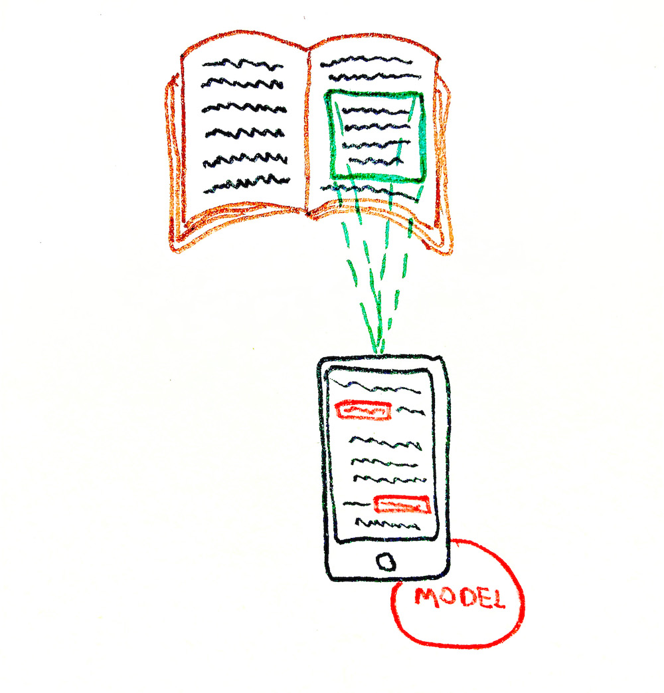

**Pros:**

- 💚 System is less complex. We don't need to set up the servers, build the API, and introduce an additional Python stack to the system.
- 💚 Offline mode is possible. The app doesn't need an internet connection to work since the model is fully loaded to the device. So the Progressive Web Application ([PWA](https://web.dev/progressive-web-apps/)) might be built to support that.
- 💚 System is "kind of" scaling automatically. The more clients you have, the more cores and GPUs they bring. This is not a proper scaling solution though (more about that in a Cons section below).
- 💚 System is cheaper. We only need a server for static assets (`HTML`, `JS`, `CSS`, model files, etc.). This may be done for free, let's say, on GitHub.
- 💚 No issue with the growing number of HTTP requests per second to the server-side.

**Cons:**

- 💔 Only horizontal scaling is possible (each client will have its own CPU/GPU). Vertical scaling is not possible since we can't influence the client's device performance. As a result, we can't guarantee fast detection for low performant devices.
- 💔 It is not possible to guard the model usage and control the callers/clients of the model. Everyone could download the model and re-use it.
- 💔 Battery consumption of the client's device might become an issue. For the model to work it needs computational resources. So clients might not be happy with their iPhone getting warmer and warmer while the app is working.

#### High-level conclusion

Since the purpose of the project was more about learning and not coming up with a production-ready solution _I decided to go with the second option of serving the model from the client side_. This made the whole project much cheaper (actually with GitHub it was free to host it), and I could focus more on Machine Learning than on the autoscaling back-end infrastructure.

### Lower level breakdown

Ok, so we've decided to go with the serverless solution. Now we have an image from the camera stream as an input that looks something like this:

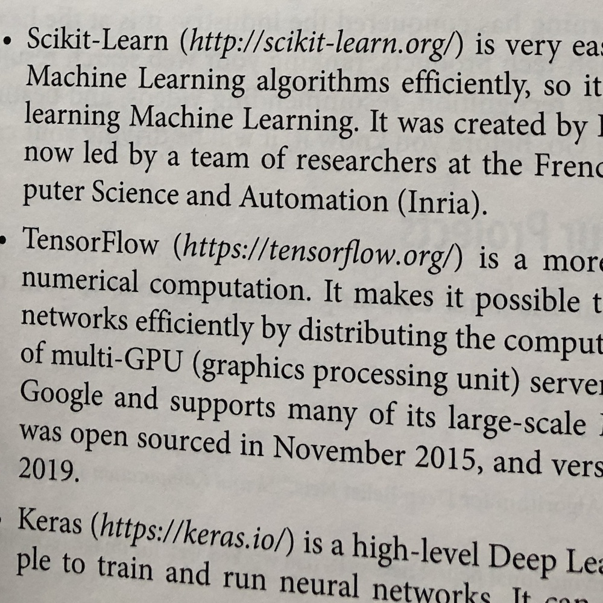

We need to solve two sub-tasks for this image:

1. Links **detection** (finding the position and bounding boxes of the links)
2. Links **recognition** (recognizing the text of the links)

#### Option 1: Tesseract based solution

The first and the most obvious approach would be to solve the _Optical Character Recognition_ ([OCR](https://en.wikipedia.org/wiki/Optical_character_recognition)) task by recognizing the whole text of the image by using, let's say, [Tesseract.js](https://github.com/naptha/tesseract.js) library. It returns the bounding boxes of the paragraphs, text lines, and text blocks along with the recognized text.

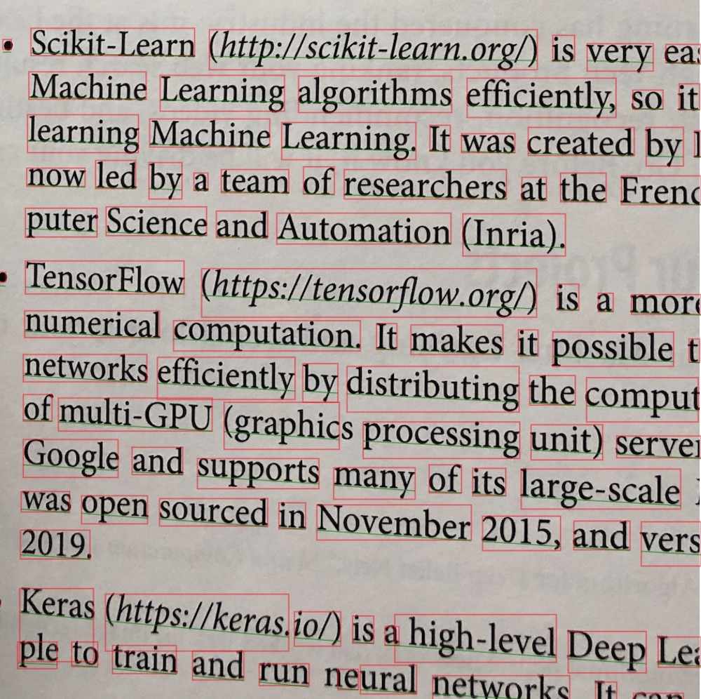

We may try then to extract the links from the recognized text lines or text blocks with a regular expression like [this one](https://stackoverflow.com/questions/3809401/what-is-a-good-regular-expression-to-match-a-url) (example is on TypeScript):

```typescript
const URL_REG_EXP = /https?:\/\/(www\.)?[-a-zA-Z0-9@:%._+~#=]{2,256}\.[a-z]{2,4}\b([-a-zA-Z0-9@:%_+.~#?&/=]*)/gi;

const extractLinkFromText = (text: string): string | null => {
  const urls: string[] | null = text.match(URL_REG_EXP);
  if (!urls || !urls.length) {
    return null;
  }
  return urls[0];
};
```

💚 Seems like the issue is solved in a pretty straightforward and simple way:

- We know the bounding boxes of the links
- We also know the text of the links to make them clickable

💔 The thing is that the _recognition + detection_ time may vary from `2` to `20+` seconds depending on the size of the text, on the amount of "something that looks like a text" on the image, on the image quality and on other factors. So it will be really hard to achieve those `0.5-1` frames per second to make the user experience at least _close_ to real-time.

💔 Also if we would think about it, we're asking the library to recognize the **whole** text from the image for us even though it might contain only one or two links in it (i.e. only ~10% of the text might be useful for us), or it may even not contain the links at all. In this case, it sounds like a waste of computational resources.

#### Option 2: Tesseract + TensorFlow based solution

We could make Tesseract work faster if we used some _additional "adviser" algorithm_ prior to the links text recognition. This "adviser" algorithm should detect, but not recognize, _the leftmost position_ of each link on the image if there are any. This will allow us to speed up the recognition part by following these rules:

1. If the image does not contain any link we should not call Tesseract detection/recognition at all.
2. If the image does have the links then we need to ask Tesseract to recognize only those parts of the image that contains the links. We're not interested in spending the time for recognition of the irrelevant text that does not contain the links.

The "adviser" algorithm that will take place before the Tesseract should work with a constant time regardless of the image quality, or the presence/absence of the text on the image. It also should be pretty fast and detect the leftmost positions of the links for less than `1s` so that we could satisfy the "close-to-real-time" requirement (i.e. on iPhone X).

> 💡 So what if we will use another object detection model to help us find all occurrences of the `https://` substrings (every secure link has this prefix, doesn't it) in the image? Then, having these `https://` bounding boxes in the text we may extract the right-side continuation of them and send them to the Tesseract for text recognition.

Take a look at the picture below:


You may notice that Tesseract needs to do **much less** work in case if it would have some hints about where are the links might be located (see the number of blue boxes on both pictures).

So the question now is which object detection model we should choose and how to re-train it to support the detection of the custom `https://` objects.

> Finally! We've got closer to the TensorFlow part of the article 😀

## 🤖 Selecting the Object Detection Model

Training a new object detection model is not a reasonable option in our context because of the following reasons:

- 💔 The training process might take days/weeks and bucks.
- 💔 We most probably won't be able to collect hundreds of thousands of _labeled_ images of the books that have links in them (we might try to generate them though, but more about that later).

So instead of creating a new model, we should better teach an existing object detection model to do the custom object detection for us (to do the [transfer learning](https://en.wikipedia.org/wiki/Transfer_learning)). In our case, the "custom objects" would be the images with `https://` text drawn in them. This approach has the following benefits:

- 💚 The dataset might be much smaller. We don't need to collect hundreds of thousands of the labeled images. Instead, we may do `~100` pictures and label them manually. This is because the model is already pre-trained on the general dataset like [COCO dataset](https://cocodataset.org/#home) and already learned how to extract general image features.
- 💚 The training process will be much faster (minutes/hours on GPU instead of days/weeks). Again, this is because of a smaller dataset (smaller batches) and because of fewer trainable parameters.

We may choose the existing model from [TensorFlow 2 Detection Model Zoo](https://github.com/tensorflow/models/blob/master/research/object_detection/g3doc/tf2_detection_zoo.md) which provides a collection of detection models pre-trained on the [COCO 2017 dataset](https://cocodataset.org/#home). Now it contains `~40` model variations to choose from.

To re-train and fine-tune the model on the custom dataset we will use a [TensorFlow 2 Object Detection API](https://github.com/tensorflow/models/tree/master/research/object_detection). The TensorFlow Object Detection API is an open-source framework built on top of [TensorFlow](https://www.tensorflow.org/) that makes it easy to construct, train, and deploy object detection models.

If you follow the [Model Zoo](https://github.com/tensorflow/models/blob/master/research/object_detection/g3doc/tf2_detection_zoo.md) link you will find the _detection speed_ and _accuracy_ for each model.

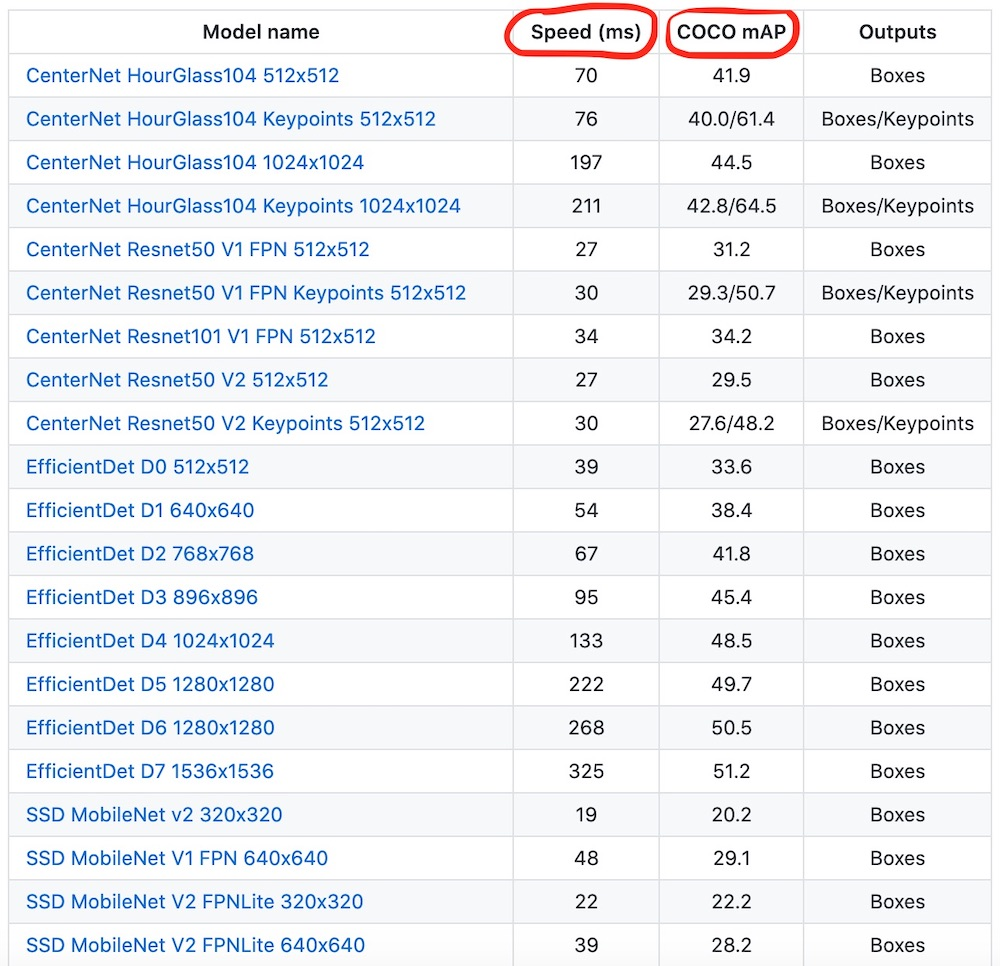

*Image source: [TensorFlow Model Zoo](https://github.com/tensorflow/models/blob/master/research/object_detection/g3doc/tf2_detection_zoo.md) repository*

Of course, we would want to find the right balance between the detection **speed** and **accuracy** while picking the model. But what might be even more important in our case is the **size** of the model since it will be loaded to the client-side.

The size of the archived model might vary drastically from `~20Mb` to `~1Gb`. Here are several examples:

- `1386 (Mb)` `centernet_hg104_1024x1024_kpts_coco17_tpu-32`
- ` 330 (Mb)` `centernet_resnet101_v1_fpn_512x512_coco17_tpu-8`
- ` 195 (Mb)` `centernet_resnet50_v1_fpn_512x512_coco17_tpu-8`
- ` 198 (Mb)` `centernet_resnet50_v1_fpn_512x512_kpts_coco17_tpu-8`
- ` 227 (Mb)` `centernet_resnet50_v2_512x512_coco17_tpu-8`
- ` 230 (Mb)` `centernet_resnet50_v2_512x512_kpts_coco17_tpu-8`
- `  29 (Mb)` `efficientdet_d0_coco17_tpu-32`
- `  49 (Mb)` `efficientdet_d1_coco17_tpu-32`
- `  60 (Mb)` `efficientdet_d2_coco17_tpu-32`
- `  89 (Mb)` `efficientdet_d3_coco17_tpu-32`
- ` 151 (Mb)` `efficientdet_d4_coco17_tpu-32`
- ` 244 (Mb)` `efficientdet_d5_coco17_tpu-32`
- ` 376 (Mb)` `efficientdet_d6_coco17_tpu-32`
- ` 376 (Mb)` `efficientdet_d7_coco17_tpu-32`
- ` 665 (Mb)` `extremenet`
- ` 427 (Mb)` `faster_rcnn_inception_resnet_v2_1024x1024_coco17_tpu-8`
- ` 424 (Mb)` `faster_rcnn_inception_resnet_v2_640x640_coco17_tpu-8`
- ` 337 (Mb)` `faster_rcnn_resnet101_v1_1024x1024_coco17_tpu-8`
- ` 337 (Mb)` `faster_rcnn_resnet101_v1_640x640_coco17_tpu-8`
- ` 343 (Mb)` `faster_rcnn_resnet101_v1_800x1333_coco17_gpu-8`
- ` 449 (Mb)` `faster_rcnn_resnet152_v1_1024x1024_coco17_tpu-8`
- ` 449 (Mb)` `faster_rcnn_resnet152_v1_640x640_coco17_tpu-8`
- ` 454 (Mb)` `faster_rcnn_resnet152_v1_800x1333_coco17_gpu-8`
- ` 202 (Mb)` `faster_rcnn_resnet50_v1_1024x1024_coco17_tpu-8`
- ` 202 (Mb)` `faster_rcnn_resnet50_v1_640x640_coco17_tpu-8`
- ` 207 (Mb)` `faster_rcnn_resnet50_v1_800x1333_coco17_gpu-8`
- ` 462 (Mb)` `mask_rcnn_inception_resnet_v2_1024x1024_coco17_gpu-8`
- `  86 (Mb)` `ssd_mobilenet_v1_fpn_640x640_coco17_tpu-8`
- `  44 (Mb)` `ssd_mobilenet_v2_320x320_coco17_tpu-8`
- `  20 (Mb)` `ssd_mobilenet_v2_fpnlite_320x320_coco17_tpu-8`
- `  20 (Mb)` `ssd_mobilenet_v2_fpnlite_640x640_coco17_tpu-8`
- ` 369 (Mb)` `ssd_resnet101_v1_fpn_1024x1024_coco17_tpu-8`
- ` 369 (Mb)` `ssd_resnet101_v1_fpn_640x640_coco17_tpu-8`
- ` 481 (Mb)` `ssd_resnet152_v1_fpn_1024x1024_coco17_tpu-8`
- ` 480 (Mb)` `ssd_resnet152_v1_fpn_640x640_coco17_tpu-8`
- ` 233 (Mb)` `ssd_resnet50_v1_fpn_1024x1024_coco17_tpu-8`
- ` 233 (Mb)` `ssd_resnet50_v1_fpn_640x640_coco17_tpu-8`

The **`ssd_mobilenet_v2_fpnlite_640x640_coco17_tpu-8`** model might be a good fit in our case:

- 💚 It is relatively lightweight: `20Mb` archived.
- 💚 It is pretty fast: `39ms` for the detection.
- 💚 It uses the MobileNet v2 network as a feature extractor which is optimized for usage on mobile devices to reduce energy consumption.
- 💚 It does the object detection for the whole image and for all objects in it **in one go** regardless of the image content (no [regions proposal](https://en.wikipedia.org/wiki/Region_Based_Convolutional_Neural_Networks) step is involved which makes the detection faster).
- 💔 It is not the most accurate model though (everything is a tradeoff ⚖️).

The model name encodes some several important characteristics that you may read more about if you want:

- The expected image input size is `640x640px`.
- The model implements [Single Shot MultiBox Detector](https://arxiv.org/abs/1512.02325) (SSD) and [Feature Pyramid Network](https://arxiv.org/abs/1612.03144) (FPN).
- [MobileNet v2](https://ai.googleblog.com/2018/04/mobilenetv2-next-generation-of-on.html) convolutional neural network ([CNN](https://en.wikipedia.org/wiki/Convolutional_neural_network)) is used as a feature extractor.
- The model was trained on [COCO dataset](https://cocodataset.org/#home)

## 🛠 Installing Object Detection API

In this article, we're going to install the Tensorflow 2 Object Detection API _as a Python package_. It is convenient in case if you're experimenting in [Google Colab](https://colab.research.google.com/) (recommended) or in [Jupyter](https://jupyter.org/try). For both cases no local installation is needed, you may experiment right in your browser.

You may also follow the [official documentation](https://github.com/tensorflow/models/blob/master/research/object_detection/g3doc/tf2.md) if you would prefer to install Object Detection API via Docker.

> If you stuck with something during the API installation or during the dataset preparation try to read through the [TensorFlow 2 Object Detection API tutorial](https://tensorflow-object-detection-api-tutorial.readthedocs.io/en/latest/index.html) which adds a lot of useful details to this process.

First, let's clone the [API repository](https://github.com/tensorflow/models):

```bash
git clone --depth 1 https://github.com/tensorflow/models
```

_output →_

```
Cloning into 'models'...
remote: Enumerating objects: 2301, done.
remote: Counting objects: 100% (2301/2301), done.
remote: Compressing objects: 100% (2000/2000), done.
remote: Total 2301 (delta 561), reused 922 (delta 278), pack-reused 0
Receiving objects: 100% (2301/2301), 30.60 MiB | 13.90 MiB/s, done.
Resolving deltas: 100% (561/561), done.
```

Now, let's compile the [API proto files](https://github.com/tensorflow/models/tree/master/research/object_detection/protos) into Python files by using [protoc](https://grpc.io/docs/protoc-installation/) tool:

```bash
cd ./models/research
protoc object_detection/protos/*.proto --python_out=.
```

Finally, let's install the TF2 version of [setup.py](https://github.com/tensorflow/models/blob/master/research/object_detection/packages/tf2/setup.py) via `pip`:

```bash
cp ./object_detection/packages/tf2/setup.py .
pip install . --quiet
```

> It is possible that the last step will fail because of some dependency errors. In this case, you might want to run `pip install . --quiet` one more time.

We may test that installation went successfully by running the following tests:

```bash
python object_detection/builders/model_builder_tf2_test.py
```

You should see the logs that end with something similar to this:

```
[       OK ] ModelBuilderTF2Test.test_unknown_ssd_feature_extractor
----------------------------------------------------------------------
Ran 20 tests in 45.072s

OK (skipped=1)
```

The TensorFlow Object Detection API is installed! You may now use the scripts that API provides for doing the model [inference](https://github.com/tensorflow/models/blob/master/research/object_detection/colab_tutorials/inference_tf2_colab.ipynb), [training](https://github.com/tensorflow/models/blob/master/research/object_detection/g3doc/tf2_training_and_evaluation.md) or [fine-tuning](https://github.com/tensorflow/models/blob/master/research/object_detection/colab_tutorials/eager_few_shot_od_training_tf2_colab.ipynb).

## ⬇️ Downloading the Pre-Trained Model

Let's download our selected `ssd_mobilenet_v2_fpnlite_640x640_coco17_tpu-8` model from the TensorFlow Model Zoo and check how it does the general object detection (detection of the objects of classes from COCO dataset like "cat", "dog", "car", etc.).

We will use the [get_file()](https://www.tensorflow.org/api_docs/python/tf/keras/utils/get_file) TensorFlow helper to download the archived model from the URL and unpack it.

```python
import tensorflow as tf
import pathlib

MODEL_NAME = 'ssd_mobilenet_v2_fpnlite_640x640_coco17_tpu-8'
TF_MODELS_BASE_PATH = 'http://download.tensorflow.org/models/object_detection/tf2/20200711/'
CACHE_FOLDER = './cache'

def download_tf_model(model_name, cache_folder):
    model_url = TF_MODELS_BASE_PATH + model_name + '.tar.gz'
    model_dir = tf.keras.utils.get_file(
        fname=model_name,
        origin=model_url,
        untar=True,
        cache_dir=pathlib.Path(cache_folder).absolute()
    )
    return model_dir

# Start the model download.
model_dir = download_tf_model(MODEL_NAME, CACHE_FOLDER)
print(model_dir)
```

_output →_

```
/content/cache/datasets/ssd_mobilenet_v2_fpnlite_640x640_coco17_tpu-8
```

Here is how the folder structure looks so far:

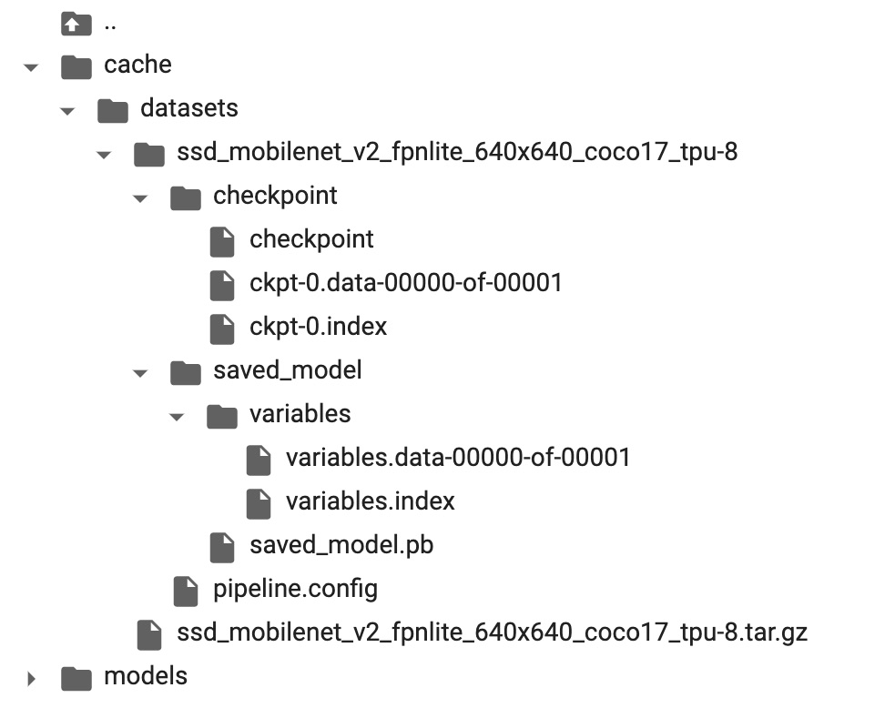

The `checkpoint` folder contains the snapshot of the pre-trained model.

The `pipeline.config` file contains the detection settings of the model. We'll come back to this file later when we will need to fine-tune the model.

## 🏄🏻‍️ Trying the Model (Doing the Inference)

For now, the model can detect the object of [90 COCO dataset classes](https://cocodataset.org/#explore) like a `car`, `bird`, `hot dog` etc.


*Image source: [COCO dataset](https://cocodataset.org/#explore) website*

Let's see how the model performs on some general images that contain the objects of these classes.

### Loading COCO labels

Object Detection API already has a complete set of COCO labels (classes) defined for us.

```python
import os

# Import Object Detection API helpers.
from object_detection.utils import label_map_util

# Loads the COCO labels data (class names and indices relations).
def load_coco_labels():
    # Object Detection API already has a complete set of COCO classes defined for us.
    label_map_path = os.path.join(
        'models/research/object_detection/data',
        'mscoco_complete_label_map.pbtxt'
    )
    label_map = label_map_util.load_labelmap(label_map_path)

    # Class ID to Class Name mapping.
    categories = label_map_util.convert_label_map_to_categories(
        label_map,
        max_num_classes=label_map_util.get_max_label_map_index(label_map),
        use_display_name=True
    )
    category_index = label_map_util.create_category_index(categories)

    # Class Name to Class ID mapping.
    label_map_dict = label_map_util.get_label_map_dict(label_map, use_display_name=True)

    return category_index, label_map_dict

# Load COCO labels.
coco_category_index, coco_label_map_dict = load_coco_labels()

print('coco_category_index:', coco_category_index)
print('coco_label_map_dict:', coco_label_map_dict)
```

_output →_

```
coco_category_index:
{
    1: {'id': 1, 'name': 'person'},
    2: {'id': 2, 'name': 'bicycle'},
    ...
    90: {'id': 90, 'name': 'toothbrush'},
}

coco_label_map_dict:
{
    'background': 0,
    'person': 1,
    'bicycle': 2,
    'car': 3,
    ...
    'toothbrush': 90,
}
```

### Build a detection function

We need to create a detection function that will use the pre-trained model we've downloaded to do the object detection.

```python
import tensorflow as tf

# Import Object Detection API helpers.
from object_detection.utils import config_util
from object_detection.builders import model_builder

# Generates the detection function for specific model and specific model's checkpoint
def detection_fn_from_checkpoint(config_path, checkpoint_path):
    # Build the model.
    pipeline_config = config_util.get_configs_from_pipeline_file(config_path)
    model_config = pipeline_config['model']
    model = model_builder.build(
        model_config=model_config,
        is_training=False,
    )

    # Restore checkpoints.
    ckpt = tf.compat.v2.train.Checkpoint(model=model)
    ckpt.restore(checkpoint_path).expect_partial()

    # This is a function that will do the detection.
    @tf.function
    def detect_fn(image):
        image, shapes = model.preprocess(image)
        prediction_dict = model.predict(image, shapes)
        detections = model.postprocess(prediction_dict, shapes)

        return detections, prediction_dict, tf.reshape(shapes, [-1])

    return detect_fn

inference_detect_fn = detection_fn_from_checkpoint(
    config_path=os.path.join('cache', 'datasets', MODEL_NAME, 'pipeline.config'),
    checkpoint_path=os.path.join('cache', 'datasets', MODEL_NAME, 'checkpoint', 'ckpt-0'),
)
```

This `inference_detect_fn` function will accept an image and will return the detected objects' info.

### Loading the images for inference

Let's try to detect the object on this image:

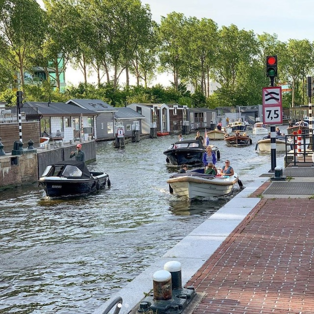

*Image source: [oleksii_trekhleb](https://www.instagram.com/oleksii_trekhleb/?hl=en) Instagram*

To do that let's save the image to the `inference/test/` folder of our project. If you're using Google Colab you may create this folder and upload the image manually.

Here is how the folder structure looks so far:

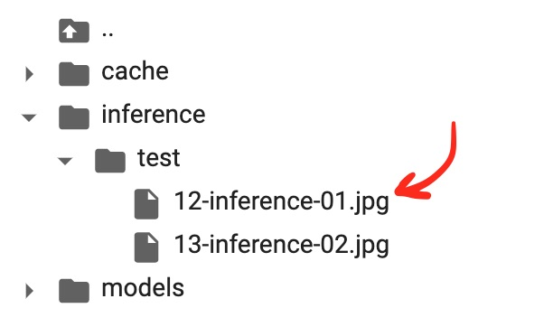

```python
import matplotlib.pyplot as plt
%matplotlib inline

# Creating a TensorFlow dataset of just one image.
inference_ds = tf.keras.preprocessing.image_dataset_from_directory(
  directory='inference',
  image_size=(640, 640),
  batch_size=1,
  shuffle=False,
  label_mode=None
)
# Numpy version of the dataset.
inference_ds_numpy = list(inference_ds.as_numpy_iterator())

# You may preview the images in dataset like this.
plt.figure(figsize=(14, 14))
for i, image in enumerate(inference_ds_numpy):
    plt.subplot(2, 2, i + 1)
    plt.imshow(image[0].astype("uint8"))
    plt.axis("off")
plt.show()
```

### Running the detection on test data

Now we're ready to run the detection. The `inference_ds_numpy[0]` array stores the pixel data for the first image in `Numpy` format.

```python
detections, predictions_dict, shapes = inference_detect_fn(
    inference_ds_numpy[0]
)
```

Let's see the shapes of the output:

```python
boxes = detections['detection_boxes'].numpy()
scores = detections['detection_scores'].numpy()
classes = detections['detection_classes'].numpy()
num_detections = detections['num_detections'].numpy()[0]

print('boxes.shape: ', boxes.shape)
print('scores.shape: ', scores.shape)
print('classes.shape: ', classes.shape)
print('num_detections:', num_detections)
```

_output →_

```
boxes.shape:  (1, 100, 4)
scores.shape:  (1, 100)
classes.shape:  (1, 100)
num_detections: 100.0
```

The model has made a `100` detections for us. It doesn't mean that it found `100` objects on the image though. It means that the model has `100` slots, and it can detect `100` objects at max on a single image. Each detection has a score that represents the confidence of the model about it. The bounding boxes for each detection are stored in the `boxes` array. The scores or confidences of the model about each detection are stored in the `scores` array. Finally, the `classes` array stores the labels (classes) for each detection.

Let's check the first 5 detections:

```python
print('First 5 boxes:')
print(boxes[0,:5])

print('First 5 scores:')
print(scores[0,:5])

print('First 5 classes:')
print(classes[0,:5])

class_names = [coco_category_index[idx + 1]['name'] for idx in classes[0]]
print('First 5 class names:')
print(class_names[:5])
```

_output →_

```
First 5 boxes:
[[0.17576033 0.84654826 0.25642633 0.88327974]
 [0.5187813  0.12410264 0.6344235  0.34545377]
 [0.5220358  0.5181462  0.6329132  0.7669856 ]
 [0.50933677 0.7045719  0.5619138  0.7446198 ]
 [0.44761637 0.51942706 0.61237675 0.75963426]]

First 5 scores:
[0.6950246 0.6343004 0.591157  0.5827219 0.5415643]

First 5 classes:
[9. 8. 8. 0. 8.]

First 5 class names:
['traffic light', 'boat', 'boat', 'person', 'boat']
```

The model sees the `traffic light`, three `boats`, and a `person` on the image. We may confirm that indeed these objects are seen on the image.

From the `scores` array may see that the model is most confident (close to 70% of probability) in the `traffic light` object.

Each entry of `boxes` array is `[y1, x1, y2, x2]`, where `(x1, y1)` and `(x2, y2)` are the top-left and bottom-right corners of the bounding box.

Let's visualize the detection boxes:

```python
# Importing Object Detection API helpers.
from object_detection.utils import visualization_utils

# Visualizes the bounding boxes on top of the image.
def visualize_detections(image_np, detections, category_index):
    label_id_offset = 1
    image_np_with_detections = image_np.copy()

    visualization_utils.visualize_boxes_and_labels_on_image_array(
        image_np_with_detections,
        detections['detection_boxes'][0].numpy(),
        (detections['detection_classes'][0].numpy() + label_id_offset).astype(int),
        detections['detection_scores'][0].numpy(),
        category_index,
        use_normalized_coordinates=True,
        max_boxes_to_draw=200,
        min_score_thresh=.4,
        agnostic_mode=False,
    )

    plt.figure(figsize=(12, 16))
    plt.imshow(image_np_with_detections)
    plt.show()

# Visualizing the detections.
visualize_detections(
    image_np=tf.cast(inference_ds_numpy[0][0], dtype=tf.uint32).numpy(),
    detections=detections,
    category_index=coco_category_index,
)
```

Here is the output:

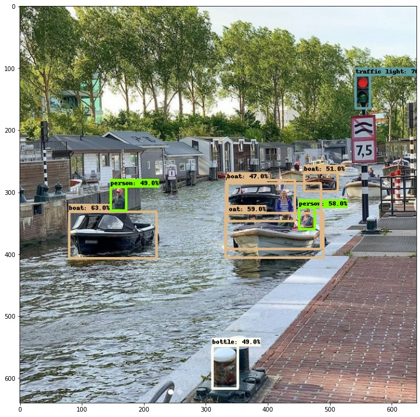

If we will do the detection for the text image here is what we will see:

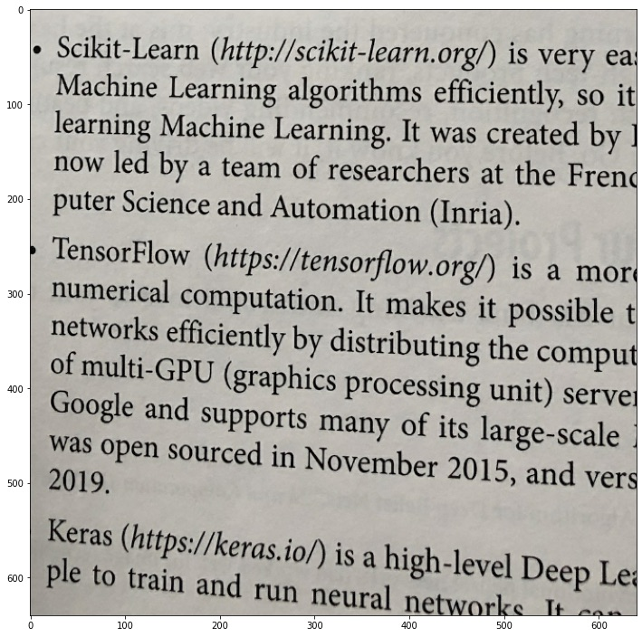

The model couldn't detect anything on this image. This is what we're going to change, we want to teach the model to "see" the `https://` prefixes on this image.

## 📝 Preparing the Custom Dataset

To "teach" the `ssd_mobilenet_v2_fpnlite_640x640_coco17_tpu-8` model to detect the custom objects which are _not_ a part of a COCO dataset we need to do the fine-tune training on a new custom dataset.

The datasets for object detection consist of two parts:

1. The image itself (i.e. the image of the book page)
2. The boundary boxes that show where exactly on the image the custom objects are located.

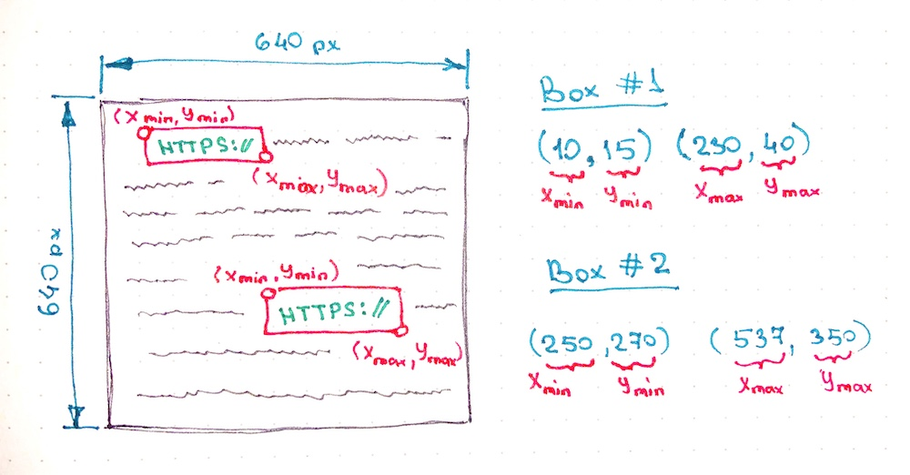

In the example above each box has `left-top` and `right-bottom` coordinates in _absolute_ values (in pixels). However, there are also different formats of writing the location of the bounding boxes exists. For example, we may locate the bounding box by setting the coordinate of its `center point` and its `width` and `height`. We might also use _relative_ values (percentage of the width and height of the image) for setting up the coordinates. But you've got the idea, the network needs to know what the image is and where on the image the objects are located.

Now, how can we get the custom dataset for training? We have three options here:

1. _Re-use_ the existing dataset.
2. _Generate_ a new dataset of fake book images.
3. _Create_ the dataset manually by taking or downloading the pictures of real book pages which contain `https://` links and labeling all bounding boxes.

### Option 1: Re-using the existing dataset

There are plenty of the datasets that are shared to be re-used by researches. We could start from the following resources to find a proper dataset:

- [Google Dataset Search](https://datasetsearch.research.google.com/)
- [Kaggle Datasets](https://www.kaggle.com/datasets)
- [awesome-public-datasets](https://github.com/awesomedata/awesome-public-datasets) repository
- etc.

💚 If you could find the needed dataset and its license allows you to re-use it, it is probably the fastest way to get straight to the model training.

💔 I couldn't find the dataset with labeled `https://` prefixes though.

So we need to skip this option.

### Option 2: Generating the synthetic dataset

There are tools that exist (i.e. [keras_ocr](https://keras-ocr.readthedocs.io/en/latest/examples/end_to_end_training.html#generating-synthetic-data)) that might help us to generate random text, include the link in it, and draw it on images with some background and distortions.

💚 The cool part about this approach is that we have the freedom to generate training examples for different _fonts_, _ligatures_, _text colors_, _background colors_. This is very useful if we want to avoid the [model overfitting](https://en.wikipedia.org/wiki/Overfitting) during the training (so that the model could generalize well to unseen real-world examples instead of failing once the background shade is changed for a bit).

💚 It is also possible to generate a variety of link types like `http://`, `http://`, `ftp://`, `tcp://` etc. Otherwise, it might be hard to find enough real-world examples of this kind of links for training.

💚 Another benefit of this approach is that we could generate as many training examples as we want. We're not limited to the number of pages of the printed book we've found for the dataset. Increasing the number of training examples may also increase the accuracy of the model.

💔 It is possible though to misuse the generator and to generate the training images that will be quite different from real-world examples. Let's say we may use the wrong and unrealistic distortions for the page (i.e. using waves bend instead of the arc one). In this case, the model will not generalize well to real-world examples.

> I see this approach as a really promising one. It may help to overcome many model issues (more on that below). I didn't try it yet though. But it might be a good candidate for another article.

### Option 3: Creating the dataset manually

The most straightforward way though is to get the book (or books) and to make the pictures of the pages with the links and to label all of them manually.

The good news is that the dataset might be pretty small (hundreds of images might be enough) because we're not going to train the model _from scratch_ but instead, we're going to do a [transfer learning](https://en.wikipedia.org/wiki/Transfer_learning) (also see the [few-shot learning](https://paperswithcode.com/task/few-shot-learning).)

💚 In this case, the training dataset will be really close to real-world data. You will literally take the printed book, take a picture of it with realistic fonts, bends, shades, perspectives, and colors.

💔 Even though it doesn't require a lot of images it may still be time-consuming.

💔 It is hard to come up with a diverse database where training examples would have different fonts, background colors, and different types of links (we need to find many diverse books and magazines to accomplish that).

Since the article has a learning purpose and since we're not trying to win an object detection competition let's go with this option for now and try to create a dataset by ourselves.

### Preprocessing the data

So, I've ended up shooting `125` images of the book pages that contain one or more `https://` links on them.

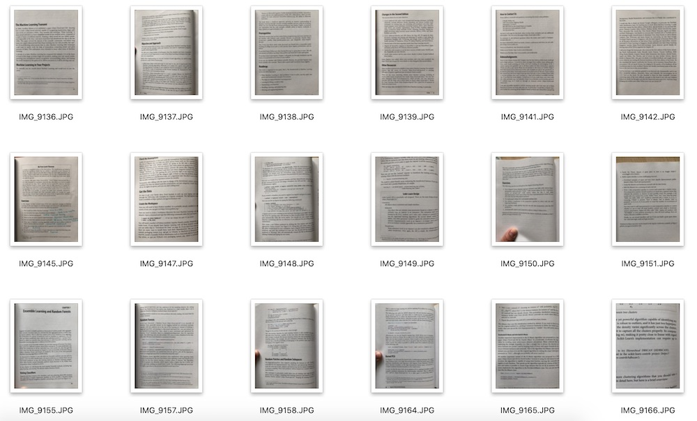

I put all these images in the `dataset/printed_links/raw` folder.

Next, I'm going to preprocess the images by doing the following:

- **Resize** each image to the width of `1024px` (they are too big originally and have a width of `3024px`)
- **Crop** each image to make them squared (this is optional, and we could just resize the image by simply squeezing it, but I want the model to be trained on realistic proportions of `https:` boxes).
- **Rotate** image if needed by applying the [exif](https://en.wikipedia.org/wiki/Exif) metadata.
- **Greyscale** the image (we don't need the model to take the colors into consideration).
- **Increase brightness**
- **Increase contrast**
- **Increase sharpness**

Remember, that once we've decided to apply these transformations and adjustments to the dataset we need to do the same in the future for each image that we will send to the model for detection.

Here is how we could apply these adjustments to the image using Python:

```python
import os
import math
import shutil

from pathlib import Path
from PIL import Image, ImageOps, ImageEnhance

# Resize an image.
def preprocess_resize(target_width):
    def preprocess(image: Image.Image, log) -> Image.Image:
        (width, height) = image.size
        ratio = width / height

        if width > target_width:
            target_height = math.floor(target_width / ratio)
            log(f'Resizing: To size {target_width}x{target_height}')
            image = image.resize((target_width, target_height))
        else:
            log('Resizing: Image already resized, skipping...')

        return image
    return preprocess

# Crop an image.
def preprocess_crop_square():
    def preprocess(image: Image.Image, log) -> Image.Image:
        (width, height) = image.size

        left = 0
        top = 0
        right = width
        bottom = height

        crop_size = min(width, height)

        if width >= height:
            # Horizontal image.
            log(f'Squre cropping: Horizontal {crop_size}x{crop_size}')
            left = width // 2 - crop_size // 2
            right = left + crop_size
        else:
            # Vetyical image.
            log(f'Squre cropping: Vertical {crop_size}x{crop_size}')
            top = height // 2 - crop_size // 2
            bottom = top + crop_size

        image = image.crop((left, top, right, bottom))
        return image
    return preprocess

# Apply exif transpose to an image.
def preprocess_exif_transpose():
    # @see: https://pillow.readthedocs.io/en/stable/reference/ImageOps.html
    def preprocess(image: Image.Image, log) -> Image.Image:
        log('EXif transpose')
        image = ImageOps.exif_transpose(image)
        return image
    return preprocess

# Apply color transformations to the image.
def preprocess_color(brightness, contrast, color, sharpness):
    # @see: https://pillow.readthedocs.io/en/3.0.x/reference/ImageEnhance.html
    def preprocess(image: Image.Image, log) -> Image.Image:
        log('Coloring')

        enhancer = ImageEnhance.Color(image)
        image = enhancer.enhance(color)

        enhancer = ImageEnhance.Brightness(image)
        image = enhancer.enhance(brightness)

        enhancer = ImageEnhance.Contrast(image)
        image = enhancer.enhance(contrast)

        enhancer = ImageEnhance.Sharpness(image)
        image = enhancer.enhance(sharpness)

        return image
    return preprocess

# Image pre-processing pipeline.
def preprocess_pipeline(src_dir, dest_dir, preprocessors=[], files_num_limit=0, override=False):
    # Create destination folder if not exists.
    Path(dest_dir).mkdir(parents=False, exist_ok=True)

    # Get the list of files to be copied.
    src_file_names = os.listdir(src_dir)
    files_total = files_num_limit if files_num_limit > 0 else len(src_file_names)
    files_processed = 0

    # Logger function.
    def preprocessor_log(message):
        print('  ' + message)

    # Iterate through files.
    for src_file_index, src_file_name in enumerate(src_file_names):
        if files_num_limit > 0 and src_file_index >= files_num_limit:
            break

        # Copy file.
        src_file_path = os.path.join(src_dir, src_file_name)
        dest_file_path = os.path.join(dest_dir, src_file_name)

        progress = math.floor(100 * (src_file_index + 1) / files_total)
        print(f'Image {src_file_index + 1}/{files_total} | {progress}% |  {src_file_path}')

        if not os.path.isfile(src_file_path):
            preprocessor_log('Source is not a file, skipping...\n')
            continue

        if not override and os.path.exists(dest_file_path):
            preprocessor_log('File already exists, skipping...\n')
            continue

        shutil.copy(src_file_path, dest_file_path)
        files_processed += 1

        # Preprocess file.
        image = Image.open(dest_file_path)

        for preprocessor in preprocessors:
            image = preprocessor(image, preprocessor_log)

        image.save(dest_file_path, quality=95)
        print('')

    print(f'{files_processed} out of {files_total} files have been processed')

# Launching the image preprocessing pipeline.
preprocess_pipeline(
    src_dir='dataset/printed_links/raw',
    dest_dir='dataset/printed_links/processed',
    override=True,
    # files_num_limit=1,
    preprocessors=[
        preprocess_exif_transpose(),
        preprocess_resize(target_width=1024),
        preprocess_crop_square(),
        preprocess_color(brightness=2, contrast=1.3, color=0, sharpness=1),
    ]
)
```

As a result, all processed images were saved to the `dataset/printed_links/processed` folder.


You may preview the images like this:

```python
import matplotlib.pyplot as plt
import numpy as np

def preview_images(images_dir, images_num=1, figsize=(15, 15)):
    image_names = os.listdir(images_dir)
    image_names = image_names[:images_num]

    num_cells = math.ceil(math.sqrt(images_num))
    figure = plt.figure(figsize=figsize)

    for image_index, image_name in enumerate(image_names):
        image_path = os.path.join(images_dir, image_name)
        image = Image.open(image_path)

        figure.add_subplot(num_cells, num_cells, image_index + 1)
        plt.imshow(np.asarray(image))

    plt.show()

preview_images('dataset/printed_links/processed', images_num=4, figsize=(16, 16))
```

### Labeling the dataset

To do the labeling (to mark the locations of the objects that we're interested in, namely the `https://` prefixes) we may use the [LabelImg](https://github.com/tzutalin/labelImg) graphical image annotation tool.

> For this step you might want to install the LabelImg tool on your local machine (not in Colab). You may find the detailed installation instructions in [LabelImg README](https://github.com/tzutalin/labelImg).

Once you have LabelImg tool installed you may launch it for the `dataset/printed_links/processed` folder from the root of your project like this:

```bash
labelImg dataset/printed_links/processed
```

Then you'll need to label all the images from the `dataset/printed_links/processed` folder and save annotations as XML files to `dataset/printed_links/labels/xml/` folder.

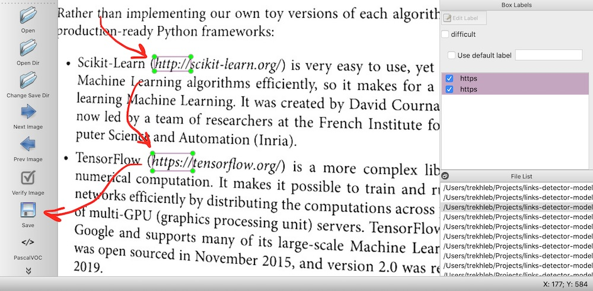

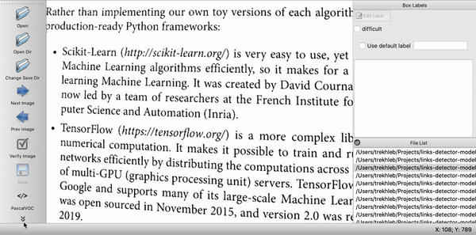

After the labeling we should have an XML file with bounding boxes data for each image:

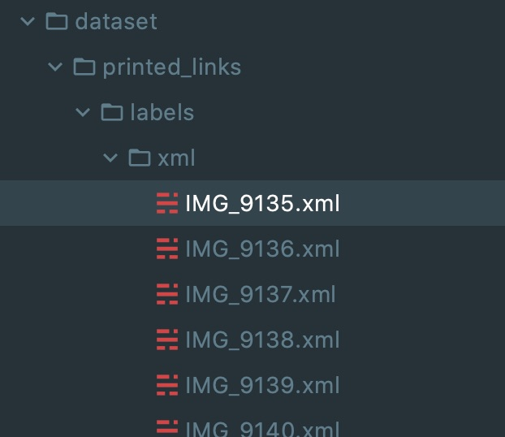

### Splitting the dataset into train, test, and validation subsets

To identify the model's [overfitting or underfitting](https://en.wikipedia.org/wiki/Overfitting) issue we need to split the dataset into `train` and `test` dataset. Let's say `80%` of our images will be used to train the model and `20%` of the images will be used to check how well the model generalizes to the images that it didn't see before.

> In this section we'll do the files splitting by copying them into different folders (`test` and `train` folders). However, this might not be the most optimal way. Instead, the splitting of the dataset may be done on [tf.data.Dataset](https://www.tensorflow.org/api_docs/python/tf/data/Dataset) level.

```python
import re
import random

def partition_dataset(
    images_dir,
    xml_labels_dir,
    train_dir,
    test_dir,
    val_dir,
    train_ratio,
    test_ratio,
    val_ratio,
    copy_xml
):
    if not os.path.exists(train_dir):
        os.makedirs(train_dir)

    if not os.path.exists(test_dir):
        os.makedirs(test_dir)

    if not os.path.exists(val_dir):
        os.makedirs(val_dir)

    images = [f for f in os.listdir(images_dir)
              if re.search(r'([a-zA-Z0-9\s_\\.\-\(\):])+(.jpg|.jpeg|.png)$', f, re.IGNORECASE)]

    num_images = len(images)

    num_train_images = math.ceil(train_ratio * num_images)
    num_test_images = math.ceil(test_ratio * num_images)
    num_val_images = math.ceil(val_ratio * num_images)

    print('Intended split')
    print(f'  train: {num_train_images}/{num_images} images')
    print(f'  test: {num_test_images}/{num_images} images')
    print(f'  val: {num_val_images}/{num_images} images')

    actual_num_train_images = 0
    actual_num_test_images = 0
    actual_num_val_images = 0

    def copy_random_images(num_images, dest_dir):
        copied_num = 0

        if not num_images:
            return copied_num

        for i in range(num_images):
            if not len(images):
                break

            idx = random.randint(0, len(images)-1)
            filename = images[idx]
            shutil.copyfile(os.path.join(images_dir, filename), os.path.join(dest_dir, filename))

            if copy_xml:
                xml_filename = os.path.splitext(filename)[0]+'.xml'
                shutil.copyfile(os.path.join(xml_labels_dir, xml_filename), os.path.join(dest_dir, xml_filename))

            images.remove(images[idx])
            copied_num += 1

        return copied_num

    actual_num_train_images = copy_random_images(num_train_images, train_dir)
    actual_num_test_images = copy_random_images(num_test_images, test_dir)
    actual_num_val_images = copy_random_images(num_val_images, val_dir)

    print('\n', 'Actual split')
    print(f'  train: {actual_num_train_images}/{num_images} images')
    print(f'  test: {actual_num_test_images}/{num_images} images')
    print(f'  val: {actual_num_val_images}/{num_images} images')

partition_dataset(
    images_dir='dataset/printed_links/processed',
    train_dir='dataset/printed_links/partitioned/train',
    test_dir='dataset/printed_links/partitioned/test',
    val_dir='dataset/printed_links/partitioned/val',
    xml_labels_dir='dataset/printed_links/labels/xml',
    train_ratio=0.8,
    test_ratio=0.2,
    val_ratio=0,
    copy_xml=True
)
```

After splitting your dataset folder structure should look similar to this:

```
dataset/
└── printed_links
    ├── labels
    │   └── xml
    ├── partitioned
    │   ├── test
    │   └── train
    │       ├── IMG_9140.JPG
    │       ├── IMG_9140.xml
    │       ├── IMG_9141.JPG
    │       ├── IMG_9141.xml
    │       ...
    ├── processed
    └── raw
```

### Exporting the dataset

The last manipulation we should do with the data is to convert our datasets into [TFRecord](https://www.tensorflow.org/tutorials/load_data/tfrecord) format. The `TFRecord` format is a format that TensorFlow is using for storing a sequence of binary records.

First, let's create two folders: one is for the labels in `CSV` format, and the other one is for the final dataset in `TFRecord` format.

```bash
mkdir -p dataset/printed_links/labels/csv
mkdir -p dataset/printed_links/tfrecords
```

Now we need to create a `dataset/printed_links/labels/label_map.pbtxt` proto file that will describe the classes of the objects in our dataset. In our case, we only have _one class_ which we may call `http`. Here is the content of this file:

```
item {
  id: 1
  name: 'http'
}
```

Now we're ready to generate the TFRecord datasets out of images in `jpg` format and labels in `xml` format:

```python
import os
import io
import math
import glob
import tensorflow as tf
import pandas as pd
import xml.etree.ElementTree as ET
from PIL import Image
from collections import namedtuple
from object_detection.utils import dataset_util, label_map_util

tf1 = tf.compat.v1

# Convers labels from XML format to CSV.
def xml_to_csv(path):
    xml_list = []
    for xml_file in glob.glob(path + '/*.xml'):
        tree = ET.parse(xml_file)
        root = tree.getroot()
        for member in root.findall('object'):
            value = (root.find('filename').text,
                int(root.find('size')[0].text),
                int(root.find('size')[1].text),
                member[0].text,
                int(member[4][0].text),
                int(member[4][1].text),
                int(member[4][2].text),
                int(member[4][3].text)
            )
            xml_list.append(value)
    column_name = ['filename', 'width', 'height', 'class', 'xmin', 'ymin', 'xmax', 'ymax']
    xml_df = pd.DataFrame(xml_list, columns=column_name)
    return xml_df


def class_text_to_int(row_label, label_map_dict):
    return label_map_dict[row_label]


def split(df, group):
    data = namedtuple('data', ['filename', 'object'])
    gb = df.groupby(group)
    return [data(filename, gb.get_group(x)) for filename, x in zip(gb.groups.keys(), gb.groups)]


# Creates a TFRecord.
def create_tf_example(group, path, label_map_dict):
    with tf1.gfile.GFile(os.path.join(path, '{}'.format(group.filename)), 'rb') as fid:
        encoded_jpg = fid.read()

    encoded_jpg_io = io.BytesIO(encoded_jpg)
    image = Image.open(encoded_jpg_io)
    width, height = image.size

    filename = group.filename.encode('utf8')
    image_format = b'jpg'
    xmins = []
    xmaxs = []
    ymins = []
    ymaxs = []
    classes_text = []
    classes = []

    for index, row in group.object.iterrows():
        xmins.append(row['xmin'] / width)
        xmaxs.append(row['xmax'] / width)
        ymins.append(row['ymin'] / height)
        ymaxs.append(row['ymax'] / height)
        classes_text.append(row['class'].encode('utf8'))
        classes.append(class_text_to_int(row['class'], label_map_dict))

    tf_example = tf1.train.Example(features=tf1.train.Features(feature={
        'image/height': dataset_util.int64_feature(height),
        'image/width': dataset_util.int64_feature(width),
        'image/filename': dataset_util.bytes_feature(filename),
        'image/source_id': dataset_util.bytes_feature(filename),
        'image/encoded': dataset_util.bytes_feature(encoded_jpg),
        'image/format': dataset_util.bytes_feature(image_format),
        'image/object/bbox/xmin': dataset_util.float_list_feature(xmins),
        'image/object/bbox/xmax': dataset_util.float_list_feature(xmaxs),
        'image/object/bbox/ymin': dataset_util.float_list_feature(ymins),
        'image/object/bbox/ymax': dataset_util.float_list_feature(ymaxs),
        'image/object/class/text': dataset_util.bytes_list_feature(classes_text),
        'image/object/class/label': dataset_util.int64_list_feature(classes),
    }))

    return tf_example


def dataset_to_tfrecord(
    images_dir,
    xmls_dir,
    label_map_path,
    output_path,
    csv_path=None
):
    label_map = label_map_util.load_labelmap(label_map_path)
    label_map_dict = label_map_util.get_label_map_dict(label_map)

    tfrecord_writer = tf1.python_io.TFRecordWriter(output_path)
    images_path = os.path.join(images_dir)
    csv_examples = xml_to_csv(xmls_dir)
    grouped_examples = split(csv_examples, 'filename')

    for group in grouped_examples:
        tf_example = create_tf_example(group, images_path, label_map_dict)
        tfrecord_writer.write(tf_example.SerializeToString())

    tfrecord_writer.close()

    print('Successfully created the TFRecord file: {}'.format(output_path))

    if csv_path is not None:
        csv_examples.to_csv(csv_path, index=None)
        print('Successfully created the CSV file: {}'.format(csv_path))

# Generate a TFRecord for train dataset.
dataset_to_tfrecord(
    images_dir='dataset/printed_links/partitioned/train',
    xmls_dir='dataset/printed_links/partitioned/train',
    label_map_path='dataset/printed_links/labels/label_map.pbtxt',
    output_path='dataset/printed_links/tfrecords/train.record',
    csv_path='dataset/printed_links/labels/csv/train.csv'
)

# Generate a TFRecord for test dataset.
dataset_to_tfrecord(
    images_dir='dataset/printed_links/partitioned/test',
    xmls_dir='dataset/printed_links/partitioned/test',
    label_map_path='dataset/printed_links/labels/label_map.pbtxt',
    output_path='dataset/printed_links/tfrecords/test.record',
    csv_path='dataset/printed_links/labels/csv/test.csv'
)
```

As a result we should now have two files: `test.record` and `train.record` in `dataset/printed_links/tfrecords/` folder:

```
dataset/
└── printed_links
    ├── labels
    │   ├── csv
    │   ├── label_map.pbtxt
    │   └── xml
    ├── partitioned
    │   ├── test
    │   ├── train
    │   └── val
    ├── processed
    ├── raw
    └── tfrecords
        ├── test.record
        └── train.record
```

These two files `test.record` and `train.record` are our final datasets that we will use to fine-tune the `ssd_mobilenet_v2_fpnlite_640x640_coco17_tpu-8` model.

## 📖 Exploring the TFRecord Datasets

In this section, we will see how we may use the TensorFlow 2 Object Detection API to explore the datasets in `TFRecord` format.

**Checking the number of items in a dataset**

To count the number of items in the dataset we may do the following:

```python
import tensorflow as tf

# Count the number of examples in the dataset.
def count_tfrecords(tfrecords_filename):
    raw_dataset = tf.data.TFRecordDataset(tfrecords_filename)
    # Keep in mind that the list() operation might be
    # a performance bottleneck for large datasets.
    return len(list(raw_dataset))

TRAIN_RECORDS_NUM = count_tfrecords('dataset/printed_links/tfrecords/train.record')
TEST_RECORDS_NUM = count_tfrecords('dataset/printed_links/tfrecords/test.record')

print('TRAIN_RECORDS_NUM: ', TRAIN_RECORDS_NUM)
print('TEST_RECORDS_NUM:  ', TEST_RECORDS_NUM)
```

_output →_

```
TRAIN_RECORDS_NUM:  100
TEST_RECORDS_NUM:   25
```

So we will train the model on `100` examples, and we will check the model accuracy on `25` test images.

**Previewing the dataset images with bounding boxes**

To preview images with detection boxes we may do the following:

```python
import tensorflow as tf
import numpy as np
from google.protobuf import text_format
import matplotlib.pyplot as plt

# Import Object Detection API.
from object_detection.utils import visualization_utils
from object_detection.protos import string_int_label_map_pb2
from object_detection.data_decoders.tf_example_decoder import TfExampleDecoder

%matplotlib inline

# Visualize the TFRecord dataset.
def visualize_tfrecords(tfrecords_filename, label_map=None, print_num=1):
    decoder = TfExampleDecoder(
        label_map_proto_file=label_map,
        use_display_name=False
    )

    if label_map is not None:
        label_map_proto = string_int_label_map_pb2.StringIntLabelMap()

        with tf.io.gfile.GFile(label_map,'r') as f:
            text_format.Merge(f.read(), label_map_proto)
            class_dict = {}

            for entry in label_map_proto.item:
                class_dict[entry.id] = {'name': entry.name}

    raw_dataset = tf.data.TFRecordDataset(tfrecords_filename)

    for raw_record in raw_dataset.take(print_num):
        example = decoder.decode(raw_record)

        image = example['image'].numpy()
        boxes = example['groundtruth_boxes'].numpy()
        confidences = example['groundtruth_image_confidences']
        filename = example['filename']
        area = example['groundtruth_area']
        classes = example['groundtruth_classes'].numpy()
        image_classes = example['groundtruth_image_classes']
        weights = example['groundtruth_weights']

        scores = np.ones(boxes.shape[0])

        visualization_utils.visualize_boxes_and_labels_on_image_array(
            image,
            boxes,
            classes,
            scores,
            class_dict,
            max_boxes_to_draw=None,
            use_normalized_coordinates=True
        )

        plt.figure(figsize=(8, 8))
        plt.imshow(image)

    plt.show()

# Visualizing the training TFRecord dataset.
visualize_tfrecords(
    tfrecords_filename='dataset/printed_links/tfrecords/train.record',
    label_map='dataset/printed_links/labels/label_map.pbtxt',
    print_num=3
)
```

As a result, we should see several images with bounding boxes drawn on top of each image.

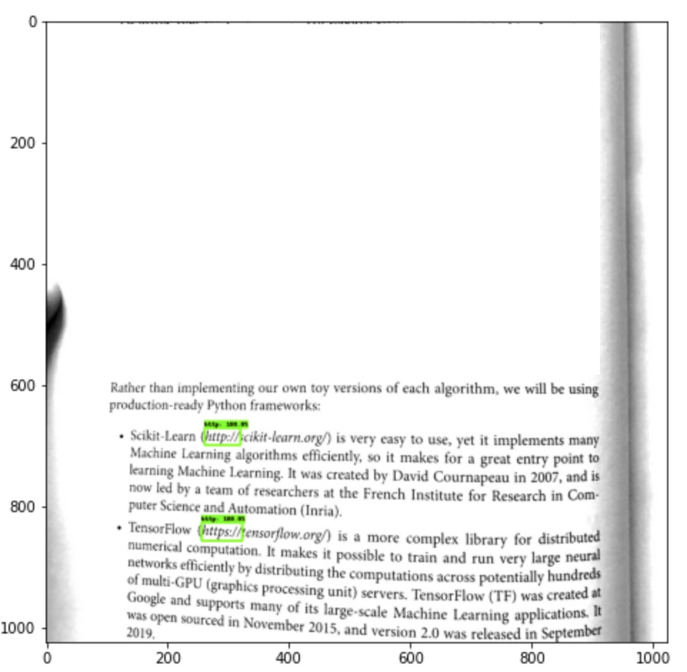

## 📈 Setting Up TensorBoard

Before starting the training process we need to launch a [TensorBoard](https://www.tensorflow.org/tensorboard).

TensorBoard will allow us to monitor the training process and see if the model is actually learning something or should we better stop the training and adjust training parameters. It will also help us to analyze what objects and at what location the model is detecting.


*Image source: [TensorBoard homepage](https://www.tensorflow.org/tensorboard)*

The cool part about TensorBoard is that we may run it directly in Google Colab. However, if you're running the notebook in your local installation of Jupyter you may also [install it as Python package](https://github.com/tensorflow/tensorboard/blob/master/README.md) and launch it from the terminal.

First, let's create a `./logs` folder where all training logs will be written:

```bash
mkdir -p logs
```

Next, we may load the TensorBoard extension on Google Colab:

```
%load_ext tensorboard
```

And finally we may launch a TensorBoard to monitor the `./logs` folder:

```
%tensorboard --logdir ./logs
```

As a result, you should see the empty TensorBoard panel:


After the model training is be started you may get back to this panel and see the training process progress.

## 🏋🏻‍️ Model Training

### Configuring the Detection Pipeline

Now it's time to get back to the `cache/datasets/ssd_mobilenet_v2_fpnlite_640x640_coco17_tpu-8/pipeline.config` file that we've mentioned earlier. This file defines the parameters of `ssd_mobilenet_v2_fpnlite_640x640_coco17_tpu-8` model training.

We need to copy the `pipeline.config` file to the root of the project and adjust a couple of things in it:

1. We should change the **number of classes** from `90` (the COCO classes) to just `1` (the `http` class).
2. We should reduce the **batch size** to `8` to avoid the errors that are connected to the insufficient memory.
3. We need to point the model to its **checkpoints** since we don't want to train the model from scratch.
4. We need to change the `fine_tune_checkpoint_type` to `detection`.
5. We need to point the model to a proper **labels map**.
6. Lastly, we need to pint the model to the **train and test datasets**.

All these changes may be done manually directly in `pipeline.config` file. But we may also do them through code:

```python
import tensorflow as tf
from shutil import copyfile
from google.protobuf import text_format
from object_detection.protos import pipeline_pb2

# Adjust pipeline config modification here if needed.
def modify_config(pipeline):
    # Model config.
    pipeline.model.ssd.num_classes = 1

    # Train config.
    pipeline.train_config.batch_size = 8

    pipeline.train_config.fine_tune_checkpoint = 'cache/datasets/ssd_mobilenet_v2_fpnlite_640x640_coco17_tpu-8/checkpoint/ckpt-0'
    pipeline.train_config.fine_tune_checkpoint_type = 'detection'

    # Train input reader config.
    pipeline.train_input_reader.label_map_path = 'dataset/printed_links/labels/label_map.pbtxt'
    pipeline.train_input_reader.tf_record_input_reader.input_path[0] = 'dataset/printed_links/tfrecords/train.record'

    # Eval input reader config.
    pipeline.eval_input_reader[0].label_map_path = 'dataset/printed_links/labels/label_map.pbtxt'
    pipeline.eval_input_reader[0].tf_record_input_reader.input_path[0] = 'dataset/printed_links/tfrecords/test.record'

    return pipeline

def clone_pipeline_config():
    copyfile(
        'cache/datasets/ssd_mobilenet_v2_fpnlite_640x640_coco17_tpu-8/pipeline.config',
        'pipeline.config'
    )

def setup_pipeline(pipeline_config_path):
    clone_pipeline_config()
    pipeline = read_pipeline_config(pipeline_config_path)
    pipeline = modify_config(pipeline)
    write_pipeline_config(pipeline_config_path, pipeline)
    return pipeline

def read_pipeline_config(pipeline_config_path):
    pipeline = pipeline_pb2.TrainEvalPipelineConfig()
    with tf.io.gfile.GFile(pipeline_config_path, "r") as f:
        proto_str = f.read()
        text_format.Merge(proto_str, pipeline)
    return pipeline

def write_pipeline_config(pipeline_config_path, pipeline):
    config_text = text_format.MessageToString(pipeline)
    with tf.io.gfile.GFile(pipeline_config_path, "wb") as f:
        f.write(config_text)

# Adjusting the pipeline configuration.
pipeline = setup_pipeline('pipeline.config')

print(pipeline)
```

Here is the content of the `pipeline.config` file:

```
model {
  ssd {
    num_classes: 1
    image_resizer {
      fixed_shape_resizer {
        height: 640
        width: 640
      }
    }
    feature_extractor {
      type: "ssd_mobilenet_v2_fpn_keras"
      depth_multiplier: 1.0
      min_depth: 16
      conv_hyperparams {
        regularizer {
          l2_regularizer {
            weight: 3.9999998989515007e-05
          }
        }
        initializer {
          random_normal_initializer {
            mean: 0.0
            stddev: 0.009999999776482582
          }
        }
        activation: RELU_6
        batch_norm {
          decay: 0.996999979019165
          scale: true
          epsilon: 0.0010000000474974513
        }
      }
      use_depthwise: true
      override_base_feature_extractor_hyperparams: true
      fpn {
        min_level: 3
        max_level: 7
        additional_layer_depth: 128
      }
    }
    box_coder {
      faster_rcnn_box_coder {
        y_scale: 10.0
        x_scale: 10.0
        height_scale: 5.0
        width_scale: 5.0
      }
    }
    matcher {
      argmax_matcher {
        matched_threshold: 0.5
        unmatched_threshold: 0.5
        ignore_thresholds: false
        negatives_lower_than_unmatched: true
        force_match_for_each_row: true
        use_matmul_gather: true
      }
    }
    similarity_calculator {
      iou_similarity {
      }
    }
    box_predictor {
      weight_shared_convolutional_box_predictor {
        conv_hyperparams {
          regularizer {
            l2_regularizer {
              weight: 3.9999998989515007e-05
            }
          }
          initializer {
            random_normal_initializer {
              mean: 0.0
              stddev: 0.009999999776482582
            }
          }
          activation: RELU_6
          batch_norm {
            decay: 0.996999979019165
            scale: true
            epsilon: 0.0010000000474974513
          }
        }
        depth: 128
        num_layers_before_predictor: 4
        kernel_size: 3
        class_prediction_bias_init: -4.599999904632568
        share_prediction_tower: true
        use_depthwise: true
      }
    }
    anchor_generator {
      multiscale_anchor_generator {
        min_level: 3
        max_level: 7
        anchor_scale: 4.0
        aspect_ratios: 1.0
        aspect_ratios: 2.0
        aspect_ratios: 0.5
        scales_per_octave: 2
      }
    }
    post_processing {
      batch_non_max_suppression {
        score_threshold: 9.99999993922529e-09
        iou_threshold: 0.6000000238418579
        max_detections_per_class: 100
        max_total_detections: 100
        use_static_shapes: false
      }
      score_converter: SIGMOID
    }
    normalize_loss_by_num_matches: true
    loss {
      localization_loss {
        weighted_smooth_l1 {
        }
      }
      classification_loss {
        weighted_sigmoid_focal {
          gamma: 2.0
          alpha: 0.25
        }
      }
      classification_weight: 1.0
      localization_weight: 1.0
    }
    encode_background_as_zeros: true
    normalize_loc_loss_by_codesize: true
    inplace_batchnorm_update: true
    freeze_batchnorm: false
  }
}
train_config {
  batch_size: 8
  data_augmentation_options {
    random_horizontal_flip {
    }
  }
  data_augmentation_options {
    random_crop_image {
      min_object_covered: 0.0
      min_aspect_ratio: 0.75
      max_aspect_ratio: 3.0
      min_area: 0.75
      max_area: 1.0
      overlap_thresh: 0.0
    }
  }
  sync_replicas: true
  optimizer {
    momentum_optimizer {
      learning_rate {
        cosine_decay_learning_rate {
          learning_rate_base: 0.07999999821186066
          total_steps: 50000
          warmup_learning_rate: 0.026666000485420227
          warmup_steps: 1000
        }
      }
      momentum_optimizer_value: 0.8999999761581421
    }
    use_moving_average: false
  }
  fine_tune_checkpoint: "cache/datasets/ssd_mobilenet_v2_fpnlite_640x640_coco17_tpu-8/checkpoint/ckpt-0"
  num_steps: 50000
  startup_delay_steps: 0.0
  replicas_to_aggregate: 8
  max_number_of_boxes: 100
  unpad_groundtruth_tensors: false
  fine_tune_checkpoint_type: "detection"
  fine_tune_checkpoint_version: V2
}
train_input_reader {
  label_map_path: "dataset/printed_links/labels/label_map.pbtxt"
  tf_record_input_reader {
    input_path: "dataset/printed_links/tfrecords/train.record"
  }
}
eval_config {
  metrics_set: "coco_detection_metrics"
  use_moving_averages: false
}
eval_input_reader {
  label_map_path: "dataset/printed_links/labels/label_map.pbtxt"
  shuffle: false
  num_epochs: 1
  tf_record_input_reader {
    input_path: "dataset/printed_links/tfrecords/test.record"
  }
}
```

### Launching the training process

We're ready now to launch a training process using the TensorFlow 2 Object Detection API. The API contains a [model_main_tf2.py](https://github.com/tensorflow/models/blob/master/research/object_detection/model_main_tf2.py) script that will run training for us. Feel free to explore the flags that this Python script supports in the source-code (i.e. `num_train_steps`, `model_dir` and others) to see their meanings.

We will be training the model for `1000` iterations (epochs). Feel free to train it for a smaller or larger number of iterations depending on the learning progress (see the TensorBoard charts).

```bash
%%bash

NUM_TRAIN_STEPS=1000
CHECKPOINT_EVERY_N=1000

PIPELINE_CONFIG_PATH=pipeline.config
MODEL_DIR=./logs
SAMPLE_1_OF_N_EVAL_EXAMPLES=1

python ./models/research/object_detection/model_main_tf2.py \
  --model_dir=$MODEL_DIR \
  --num_train_steps=$NUM_TRAIN_STEPS \
  --sample_1_of_n_eval_examples=$SAMPLE_1_OF_N_EVAL_EXAMPLES \
  --pipeline_config_path=$PIPELINE_CONFIG_PATH \
  --checkpoint_every_n=$CHECKPOINT_EVERY_N \
  --alsologtostderr
```

While the model is training (it may take around`~10 minutes` for `1000` iterations in [GoogleColab GPU](https://colab.research.google.com/notebooks/gpu.ipynb) runtime) you should be able to observe the training progress in TensorBoard. The `localization` and `classification` losses should decrease which means that the model is doing a good job in localizing and classifying new custom objects.

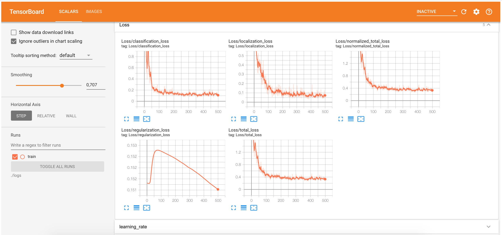

Also during the training, the new model checkpoints (parameters that the model has learned during the training) will be saved to the `logs` folder.

The `logs` folder structure now looks like this:

```
logs
├── checkpoint
├── ckpt-1.data-00000-of-00001
├── ckpt-1.index
└── train
    └── events.out.tfevents.1606560330.b314c371fa10.1747.1628.v2
```

### Evaluating the Model (Optional)

The evaluation process uses the trained model checkpoints and evaluates how well the model performs in detecting objects in the test dataset. The results of this evaluation are summarised in the form of some [metrics](https://github.com/tensorflow/models/blob/master/research/object_detection/g3doc/evaluation_protocols.md), which can be examined over time. You may read more about how to evaluate these metrics [here](https://tensorflow-object-detection-api-tutorial.readthedocs.io/en/latest/training.html#evaluating-the-model-optional).

We will skip the metrics evaluation step in this article. But we may still use the evaluation step to see the model's detections in TensorBoard:

```bash
%%bash

PIPELINE_CONFIG_PATH=pipeline.config
MODEL_DIR=logs

python ./models/research/object_detection/model_main_tf2.py \
  --model_dir=$MODEL_DIR \
  --pipeline_config_path=$PIPELINE_CONFIG_PATH \
  --checkpoint_dir=$MODEL_DIR \
```

After launching the script you should be able to see several side-by-side images with detections boxes:

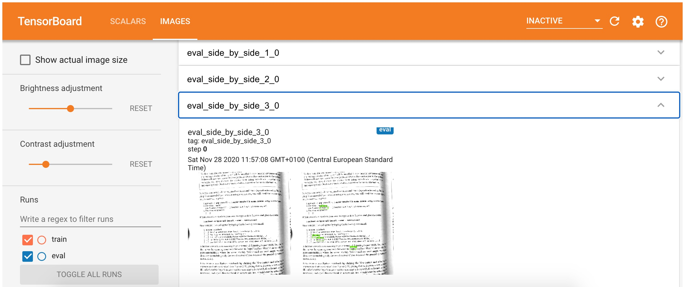

## 🗜 Exporting the Model

Once the training process is complete we should save the trained model for further usage. To export the model we will use the [exporter_main_v2.py](https://github.com/tensorflow/models/blob/master/research/object_detection/exporter_main_v2.py) script from Object Detection API. It prepares an object detection TensorFlow graph for inference using model configuration and a trained checkpoint. The script outputs associated checkpoint files, a SavedModel, and a copy of the model config:

```bash
%%bash

python ./models/research/object_detection/exporter_main_v2.py \
    --input_type=image_tensor \
    --pipeline_config_path=pipeline.config \
    --trained_checkpoint_dir=logs \
    --output_directory=exported/ssd_mobilenet_v2_fpnlite_640x640_coco17_tpu-8
```

Here is what the `exported` folder contains after the export:

```
exported
└── ssd_mobilenet_v2_fpnlite_640x640_coco17_tpu-8
    ├── checkpoint
    │   ├── checkpoint
    │   ├── ckpt-0.data-00000-of-00001
    │   └── ckpt-0.index
    ├── pipeline.config
    └── saved_model
        ├── assets
        ├── saved_model.pb
        └── variables
            ├── variables.data-00000-of-00001
            └── variables.index
```

At this moment we have a `saved_model` that may be used for inference.

## 🚀 Using the Exported Model

Let's see how can we use the saved model from the previous step for object detections.

First, we need to create a detection function that will use the saved model. It will accept the image and will output the detected objects:

```python
import time
import math

PATH_TO_SAVED_MODEL = 'exported/ssd_mobilenet_v2_fpnlite_640x640_coco17_tpu-8/saved_model'

def detection_function_from_saved_model(saved_model_path):
    print('Loading saved model...', end='')
    start_time = time.time()

    # Load saved model and build the detection function
    detect_fn = tf.saved_model.load(saved_model_path)

    end_time = time.time()
    elapsed_time = end_time - start_time

    print('Done! Took {} seconds'.format(math.ceil(elapsed_time)))

    return detect_fn

exported_detect_fn = detection_function_from_saved_model(
    PATH_TO_SAVED_MODEL
)
```

_output →_

```
Loading saved model...Done! Took 9 seconds
```

To map the IDs of the detected classes back to the class names we need to load the label map as well:

```python
from object_detection.utils import label_map_util

category_index = label_map_util.create_category_index_from_labelmap(
    'dataset/printed_links/labels/label_map.pbtxt',
    use_display_name=True
)

print(category_index)
```

_output →_

```
{1: {'id': 1, 'name': 'http'}}
```

Testing the model on a test dataset.

```python
import matplotlib.pyplot as plt
import tensorflow as tf
import numpy as np

from object_detection.utils import visualization_utils
from object_detection.data_decoders.tf_example_decoder import TfExampleDecoder

%matplotlib inline

def tensors_from_tfrecord(
    tfrecords_filename,
    tfrecords_num,
    dtype=tf.float32
):
    decoder = TfExampleDecoder()
    raw_dataset = tf.data.TFRecordDataset(tfrecords_filename)
    images = []

    for raw_record in raw_dataset.take(tfrecords_num):
        example = decoder.decode(raw_record)
        image = example['image']
        image = tf.cast(image, dtype=dtype)
        images.append(image)

    return images

def test_detection(tfrecords_filename, tfrecords_num, detect_fn):
    image_tensors = tensors_from_tfrecord(
        tfrecords_filename,
        tfrecords_num,
        dtype=tf.uint8
    )

    for image_tensor in image_tensors:
        image_np = image_tensor.numpy()

        # The model expects a batch of images, so add an axis with `tf.newaxis`.
        input_tensor = tf.expand_dims(image_tensor, 0)

        detections = detect_fn(input_tensor)

        # All outputs are batches tensors.
        # Convert to numpy arrays, and take index [0] to remove the batch dimension.
        # We're only interested in the first num_detections.
        num_detections = int(detections.pop('num_detections'))

        detections = {key: value[0, :num_detections].numpy() for key, value in detections.items()}
        detections['num_detections'] = num_detections

        # detection_classes should be ints.
        detections['detection_classes'] = detections['detection_classes'].astype(np.int64)

        image_np_with_detections = image_np.astype(int).copy()

        visualization_utils.visualize_boxes_and_labels_on_image_array(
            image_np_with_detections,
            detections['detection_boxes'],
            detections['detection_classes'],
            detections['detection_scores'],
            category_index,
            use_normalized_coordinates=True,
            max_boxes_to_draw=100,
            min_score_thresh=.3,
            agnostic_mode=False
        )

        plt.figure(figsize=(8, 8))
        plt.imshow(image_np_with_detections)

    plt.show()


test_detection(
    tfrecords_filename='dataset/printed_links/tfrecords/test.record',
    tfrecords_num=10,
    detect_fn=exported_detect_fn
)
```

As a result, you should see `10` images from the test dataset and highlighted `https:` prefixes that were detected by the model:

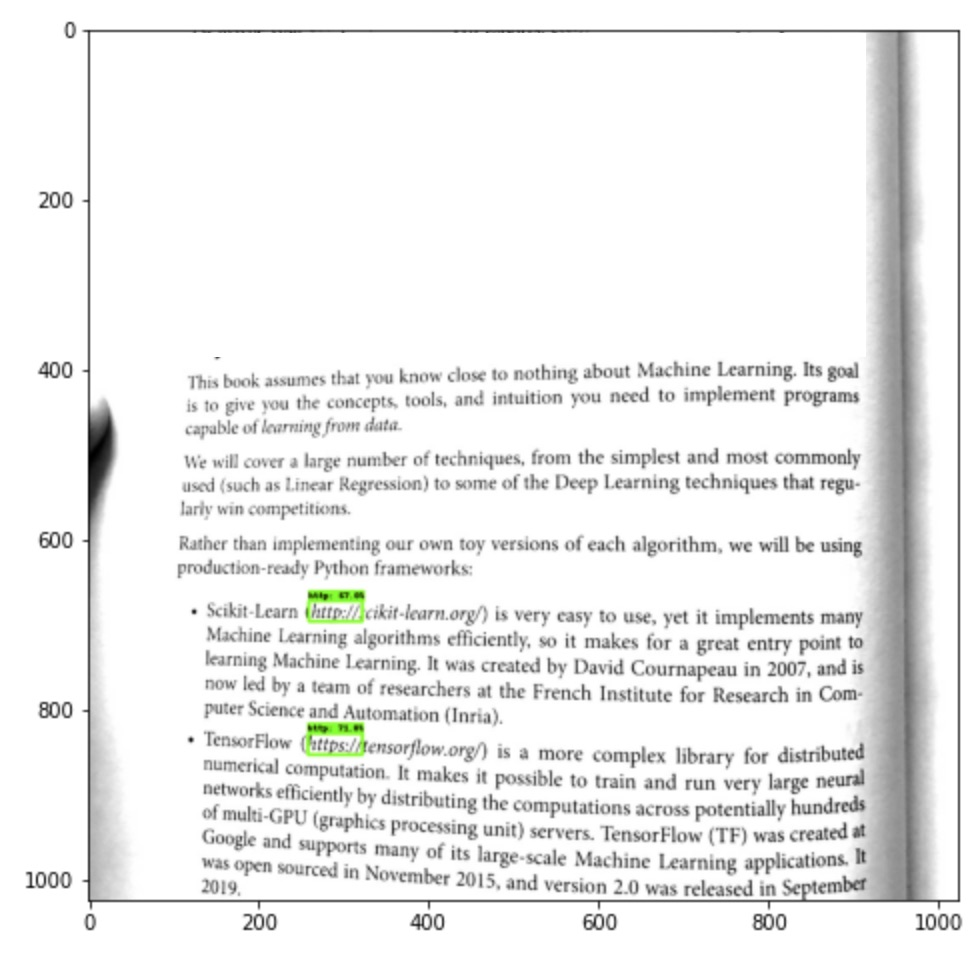

The fact that the model is able to detect custom objects (in our case the `https://` prefixes) on the images it hasn't seen before is a good sign and something that we wanted to achieve.

## 🗜 Converting the Model for Web

As you remember from the beginning of this article, our goal was to use the custom object detection model in the browser. Luckily, there is a [TensorFlow.js](https://www.tensorflow.org/js) JavaScript version of the TensorFlow library exists. In JavaScript, we can't work with our saved model directly. Instead, we need to convert it to [tfjs_graph_model](https://www.tensorflow.org/js/tutorials/conversion/import_saved_model) format.

To do this we need to install the tensorflowjs Python package:

```bash
pip install tensorflowjs --quiet
```

The model may be exported like this:

```bash
%%bash

tensorflowjs_converter \
    --input_format=tf_saved_model \
    --output_format=tfjs_graph_model \
    exported/ssd_mobilenet_v2_fpnlite_640x640_coco17_tpu-8/saved_model \
    exported_web/ssd_mobilenet_v2_fpnlite_640x640_coco17_tpu-8
```

The `exported_web` folder contains the `.json` file with the model metadata and a bunch of `.bin` files with trained model parameters:

```
exported_web
└── ssd_mobilenet_v2_fpnlite_640x640_coco17_tpu-8
    ├── group1-shard1of4.bin
    ├── group1-shard2of4.bin
    ├── group1-shard3of4.bin
    ├── group1-shard4of4.bin
    └── model.json
```

Finally, we have the model that is able to detect `https://` prefixes for us, and it is saved in JavaScript-understandable format.

Let's check the model size to see if it is light enough to be loaded completely to the client-side:

```python
import pathlib

def get_folder_size(folder_path):
    mB = 1000000
    root_dir = pathlib.Path(folder_path)
    sizeBytes = sum(f.stat().st_size for f in root_dir.glob('**/*') if f.is_file())
    return f'{sizeBytes//mB} MB'


print(f'Original model size:      {get_folder_size("cache/datasets/ssd_mobilenet_v2_fpnlite_640x640_coco17_tpu-8")}')
print(f'Exported model size:      {get_folder_size("exported/ssd_mobilenet_v2_fpnlite_640x640_coco17_tpu-8")}')
print(f'Exported WEB model size:  {get_folder_size("exported_web/ssd_mobilenet_v2_fpnlite_640x640_coco17_tpu-8")}')
```

_output →_

```
Original model size:      31 MB
Exported model size:      28 MB
Exported WEB model size:  13 MB
```

As you may see the model that we're going to use for the Web has `13MB` which is quite acceptable in our case.

Later in JavaScript we may start using the model like this:

```javascript
import * as tf from '@tensorflow/tfjs';
const model = await tf.loadGraphModel(modelURL);
```

> 🧭 The next step is to implement the Links Detector UI which will use this model, but this is another story for another article. The final source code of the application may be found in [links-detector repository](https://github.com/trekhleb/links-detector) on GitHub.

## 🤔 Conclusions

In this article, we started to solve the issue with printed links detection. We ended up creating the custom object detector to recognize the `https://` prefixes on text images (i.e. on smartphone camera stream images). We have also converted the model to a `tfjs_graph_model` to be able to re-use it on the client-side.

You may 🚀 [launch Links Detector demo](https://trekhleb.dev/links-detector/) from your smartphone to see the final result and to try how the model performs on your books or magazines.

Here is how the final solution looks like:


You may also 📝 [browse the links-detector repository](https://github.com/trekhleb/links-detector) on GitHub to see the complete source code of the UI part of the application.

> ⚠️ Currently the application is in _experimental_ _Alpha_ stage and has [many issues and limitations](https://github.com/trekhleb/links-detector/issues?q=is%3Aopen+is%3Aissue+label%3Aenhancement). So don't raise your expectations level too high until these issues are resolved 🤷🏻‍.

As the next steps which might improve the model performance we might do the following:

- Extend the dataset with more link types (`http://`, `tcp://`, `ftp://` etc)
- Extended the dataset with images that have dark backgrounds
- Extend the dataset with underlined links
- Extend the dataset with examples of different fonts and ligatures
- etc.

Even though the model has a lot to be improved to make it closer to the production-ready state, I still hope that this article was useful for you and gave you some guidelines and inspiration to play around with your custom object detectors.

Happy training, folks!

